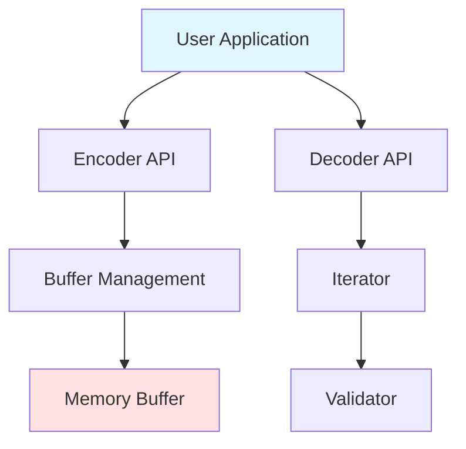
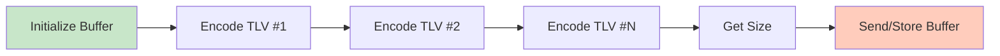
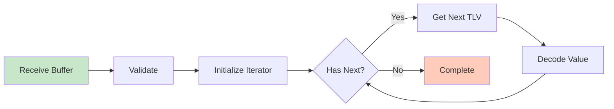
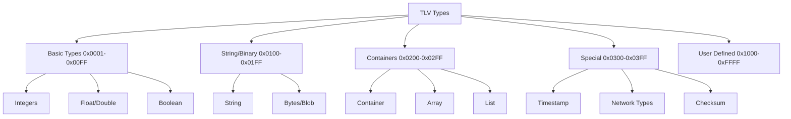
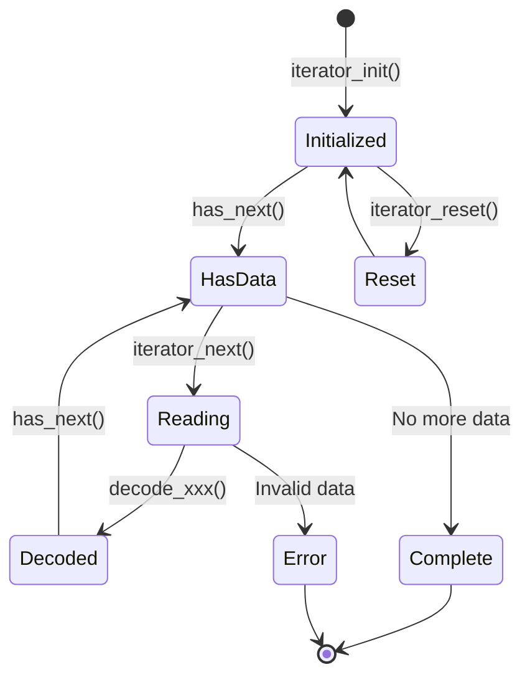
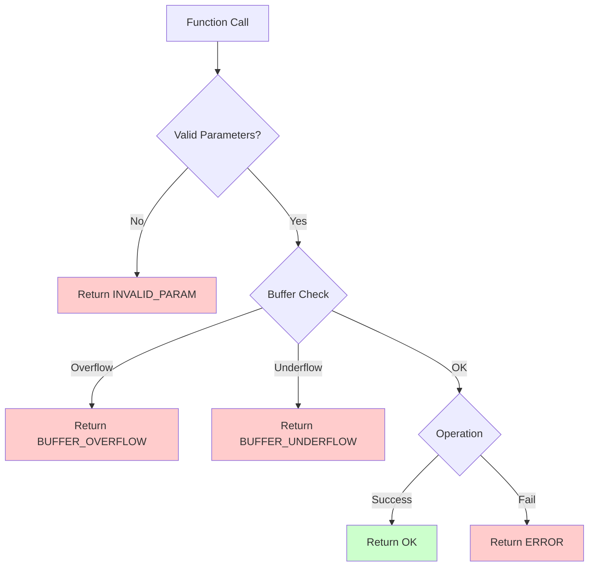
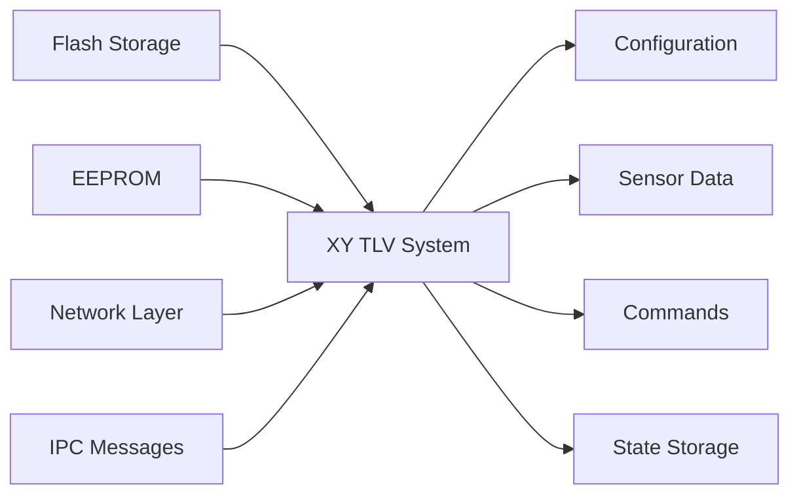

# XY TLV Architecture

## System Architecture



## Component Flow

### Encoding Flow


### Decoding Flow


## TLV Binary Format

```
┌─────────────────────────────────────────────────┐
│           Single TLV Element                    │
├─────────┬─────────┬─────────┬─────────┬────────┤
│ Type    │ Type    │ Length  │ Length  │ Value  │
│ (MSB)   │ (LSB)   │ (MSB)   │ (LSB)   │        │
│ 1 byte  │ 1 byte  │ 1 byte  │ 1 byte  │ N bytes│
└─────────┴─────────┴─────────┴─────────┴────────┘
   Byte 0    Byte 1    Byte 2    Byte 3    4 ... N

Example: Encode uint32 value 0x12345678 with type 0x1001

┌────────┬────────┬────────┬────────┬────────┬────────┬────────┬────────┐
│  0x10  │  0x01  │  0x00  │  0x04  │  0x12  │  0x34  │  0x56  │  0x78  │
└────────┴────────┴────────┴────────┴────────┴────────┴────────┴────────┘
  Type=0x1001      Length=4         Value=0x12345678

Total size: 8 bytes (4 header + 4 value)
```

## Buffer Structure

```
┌──────────────────────────────────────────────────────────────┐
│                    TLV Buffer                                │
├──────────────────────────────────────────────────────────────┤
│ TLV #1 Header (4) │ TLV #1 Value (N₁)                       │
├───────────────────┴──────────────────────────────────────────┤
│ TLV #2 Header (4) │ TLV #2 Value (N₂)                       │
├───────────────────┴──────────────────────────────────────────┤
│ TLV #3 Header (4) │ TLV #3 Value (N₃)                       │
├───────────────────┴──────────────────────────────────────────┤
│                        ...                                    │
├───────────────────────────────────────────────────────────────┤
│ TLV #N Header (4) │ TLV #N Value (Nₙ)                       │
└───────────────────┴───────────────────────────────────────────┘

Total Size = Σ(4 + Value_Length_i) for i=1 to N
```

## Data Type Hierarchy



## API Layer Structure

```
┌──────────────────────────────────────────────────────────┐
│                   User Application                       │
└───────────────────┬──────────────────────────────────────┘
                    │
    ┌───────────────┴───────────────┐
    │                               │
┌───▼────────────┐        ┌────────▼───────┐
│  Encode APIs   │        │  Decode APIs   │
├────────────────┤        ├────────────────┤
│ - encode_uint8 │        │ - decode_uint8 │
│ - encode_uint16│        │ - decode_uint16│
│ - encode_uint32│        │ - decode_uint32│
│ - encode_string│        │ - decode_string│
│ - encode_bytes │        │ - decode_bytes │
│      ...       │        │      ...       │
└────────┬───────┘        └────────┬───────┘
         │                         │
         └──────────┬──────────────┘
                    │
         ┌──────────▼──────────┐
         │   Core Functions    │
         ├─────────────────────┤
         │ - Buffer Init       │
         │ - Iterator Init     │
         │ - Validate          │
         │ - Checksum          │
         └──────────┬──────────┘
                    │
         ┌──────────▼──────────┐
         │  Helper Functions   │
         ├─────────────────────┤
         │ - read_uint16       │
         │ - write_uint16      │
         │ - read_uint32       │
         │ - write_uint32      │
         └──────────┬──────────┘
                    │
         ┌──────────▼──────────┐
         │   Memory Buffer     │
         └─────────────────────┘
```

## State Machine - Iterator



## Memory Layout - Encoding Buffer

```
xy_tlv_buffer_t structure:
┌─────────────────────────────────────┐
│ buffer (pointer)                    │ ───┐
├─────────────────────────────────────┤    │
│ capacity (uint16_t)                 │    │
├─────────────────────────────────────┤    │
│ offset (uint16_t)                   │    │
├─────────────────────────────────────┤    │
│ nesting (uint8_t)                   │    │
└─────────────────────────────────────┘    │
                                            │
                                            │
              ┌─────────────────────────────┘
              │
              ▼
┌──────────────────────────────────────────────────────┐
│                 User-provided buffer                  │
├──────────────────────────────────────────────────────┤
│  Used space (offset bytes)  │  Free space            │
│  ◄─────────────────────────►│◄──────────────────────►│
└──────────────────────────────────────────────────────┘
0                           offset                  capacity
```

## Nested Container Example

```
┌────────────────────────────────────────────────────────┐
│ Container TLV                                          │
├──────────┬──────────┬──────────────────────────────────┤
│Type:CONT │Length: N │ Value (nested TLVs)             │
└──────────┴──────────┴──────────────────────────────────┘
                       │
                       └─┬────────────────────────┬───────
                         │                        │
              ┌──────────▼──────┐      ┌─────────▼────────┐
              │ TLV #1          │      │ TLV #2           │
              ├─────┬─────┬─────┤      ├─────┬─────┬──────┤
              │Type │Len  │Value│      │Type │Len  │Value │
              └─────┴─────┴─────┘      └─────┴─────┴──────┘

Nesting level tracking prevents overflow (max: XY_TLV_MAX_NESTING_LEVEL)
```

## Error Handling Flow



## Performance Characteristics

### Time Complexity

| Operation | Best | Average | Worst | Notes |
|-----------|------|---------|-------|-------|
| Encode | O(1) | O(1) | O(1) | Direct write |
| Decode | O(1) | O(1) | O(1) | Zero-copy |
| Find | O(n) | O(n) | O(n) | Linear search |
| Validate | O(n) | O(n) | O(n) | Single pass |
| Checksum | O(n) | O(n) | O(n) | Full scan |

### Space Complexity

| Component | Size | Notes |
|-----------|------|-------|
| TLV Header | 4 bytes | Fixed |
| Buffer Context | 12 bytes | Per encoder |
| Iterator | 16 bytes | Per decoder |
| Statistics | 24 bytes | Global |
| User Buffer | Variable | Provided by user |

## Thread Safety Model

```
Thread 1                    Thread 2
┌────────────┐             ┌────────────┐
│  Buffer A  │             │  Buffer B  │
│  Iterator A│             │  Iterator B│
└─────┬──────┘             └─────┬──────┘
      │                          │
      └──────────┬───────────────┘
                 │
                 ▼
         ┌───────────────┐
         │ Global Stats  │ ◄── Needs mutex if shared
         └───────────────┘

Recommendation: Separate buffers per thread, no shared state.
```

## Integration Points



## Design Principles

1. **Zero Allocation**
   - User provides all buffers
   - No malloc/free calls
   - Predictable memory usage

2. **Type Safety**
   - Dedicated encode/decode per type
   - Compile-time type checking
   - Automatic endianness handling

3. **Error Resilience**
   - Comprehensive validation
   - Clear error codes
   - Graceful degradation

4. **Performance**
   - Zero-copy parsing
   - Single-pass operations
   - Minimal overhead

5. **Portability**
   - C99 standard only
   - No platform dependencies
   - Network byte order

6. **Extensibility**
   - Custom type support
   - Nested containers
   - User-defined ranges
