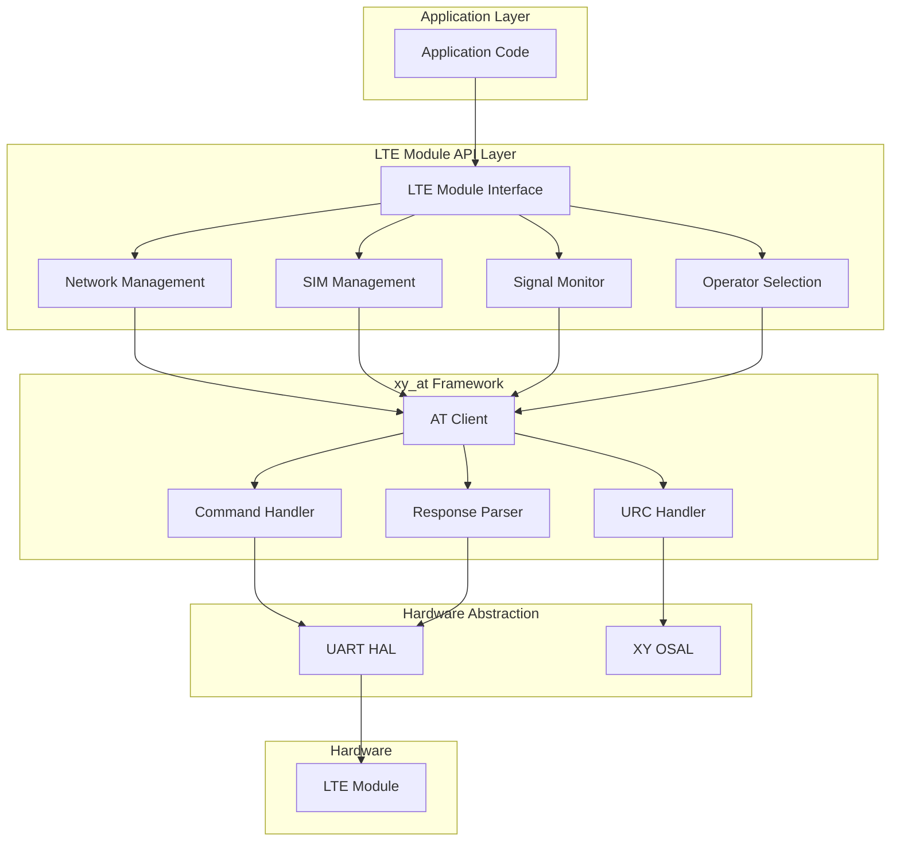
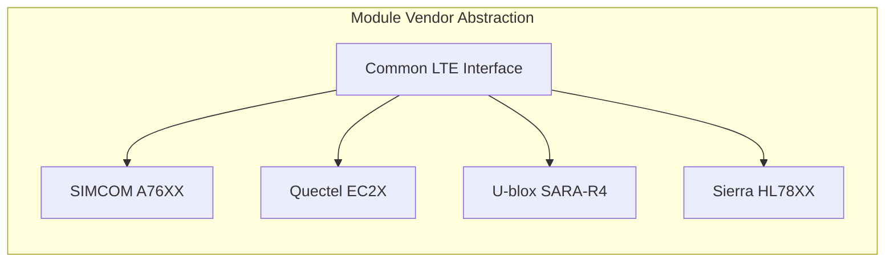
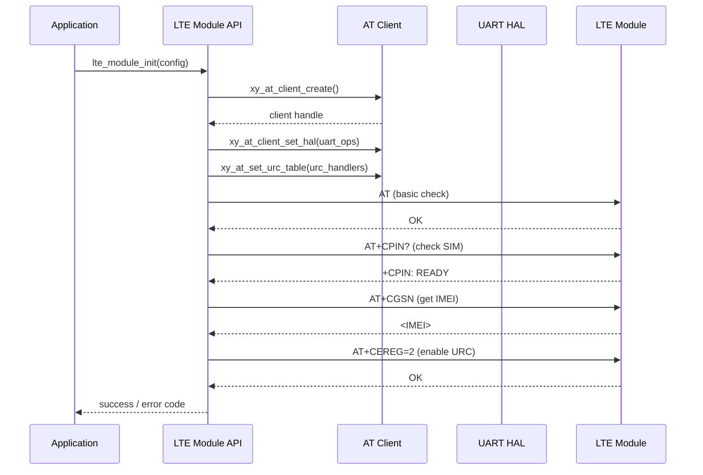
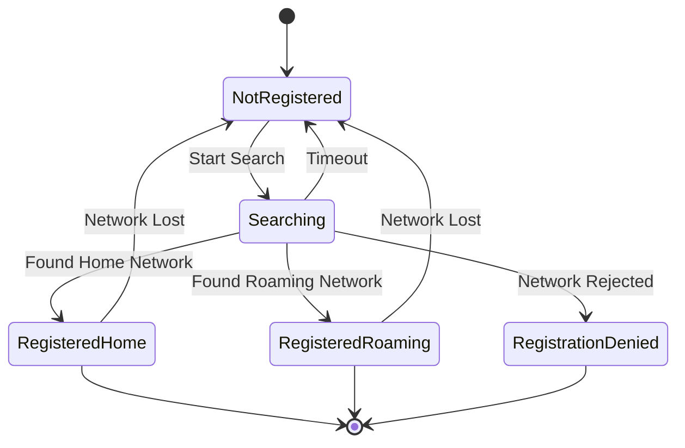
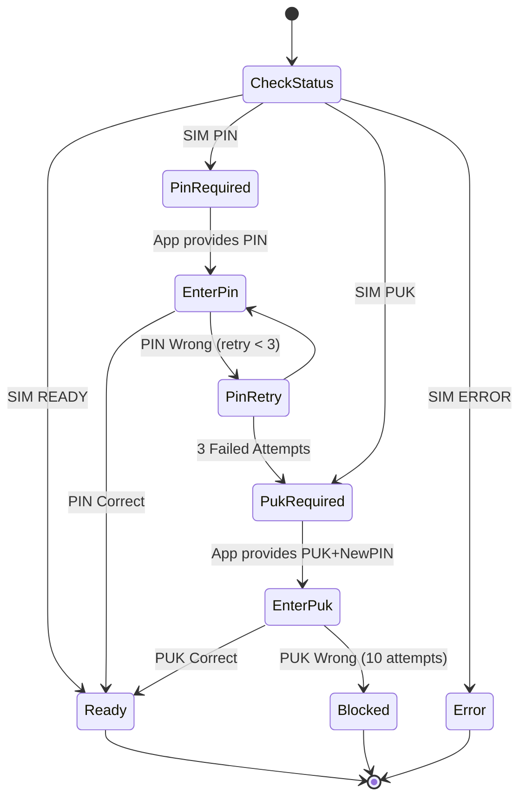
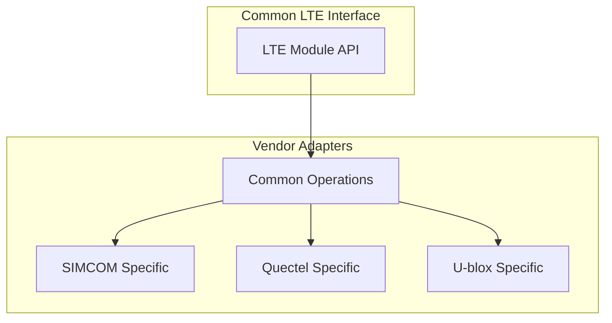
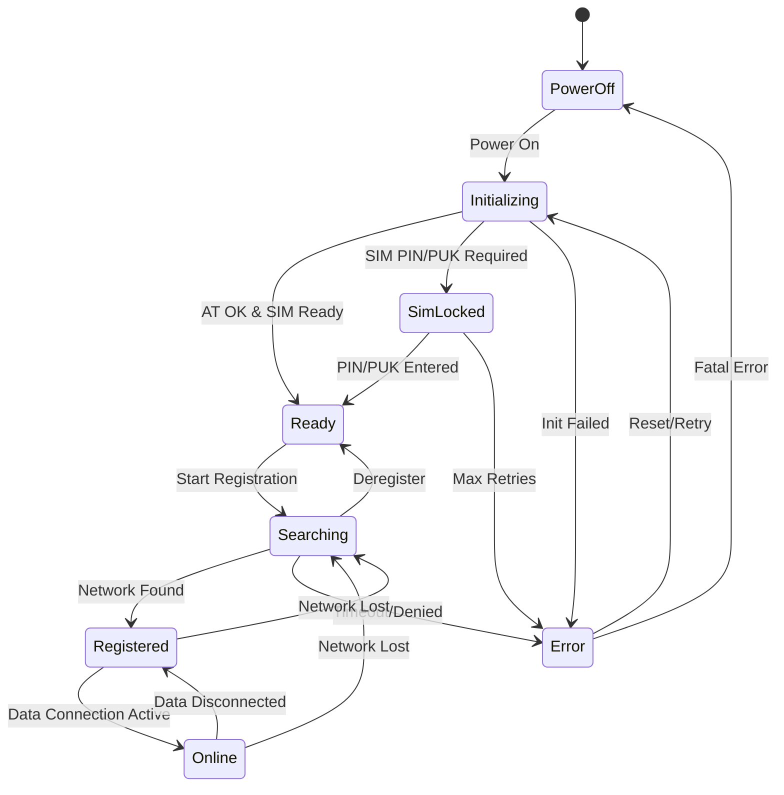
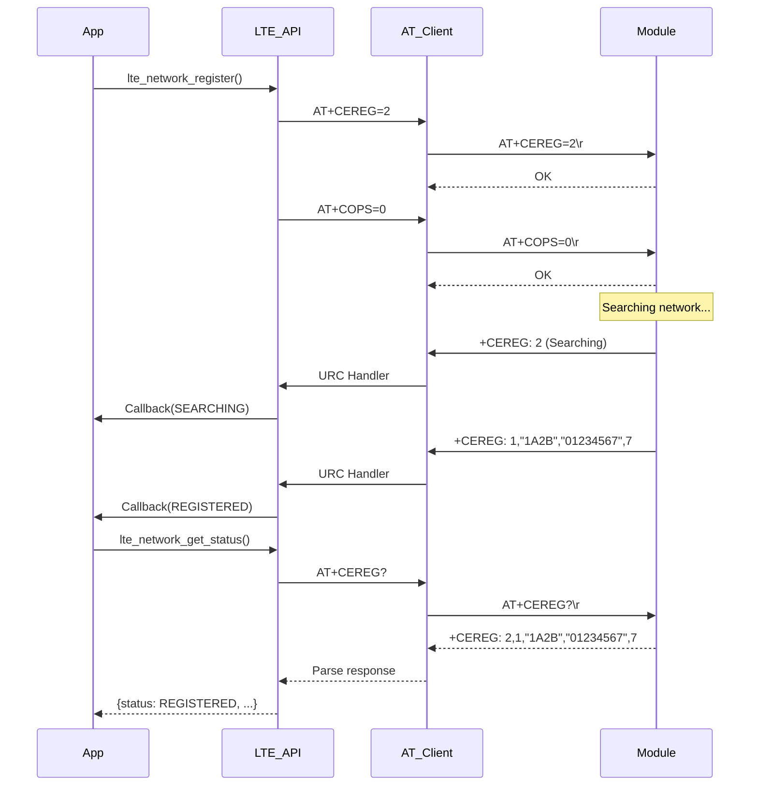
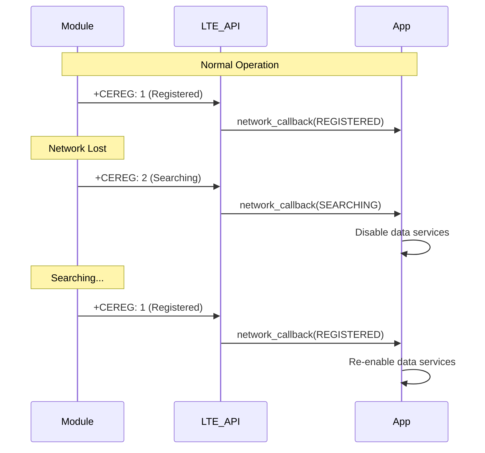
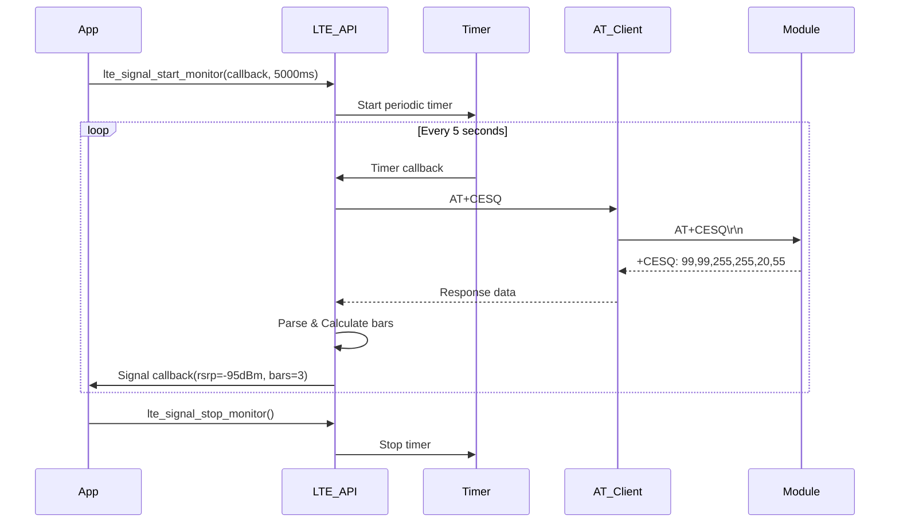

# LTE AT Command Communication Implementation Design

## Overview

This document defines the design for implementing LTE module AT command communication interfaces based on the xy_at framework. The system provides comprehensive network query capabilities, basic communication interfaces, and module management for LTE/4G cellular modules including Cat-M1, Cat-NB1, and standard LTE variants.

### Purpose

Enable embedded applications to communicate with LTE cellular modules through standardized 3GPP AT commands, providing network registration, signal monitoring, SIM management, network operator selection, and connection status tracking.

### Design Goals

- **Modularity**: Reusable components for different LTE module vendors
- **Standard Compliance**: 3GPP TS 27.007 AT command compatibility
- **Abstraction**: Unified interface hiding vendor-specific differences
- **Reliability**: Robust error handling and retry mechanisms
- **Efficiency**: Minimal resource footprint for embedded systems
- **Extensibility**: Easy integration of new LTE module types

## Technology Stack

| Component | Technology/Framework |
|-----------|---------------------|
| **AT Framework** | xy_at (client-based architecture) |
| **OS Abstraction** | XY OSAL (FreeRTOS/RT-Thread/Bare-metal) |
| **HAL Layer** | xy_hal_uart for hardware abstraction |
| **Language** | C (embedded C11) |
| **Standards** | 3GPP TS 27.007, 3GPP TS 27.005 |

## Architecture

### System Architecture



### Component Hierarchy



## LTE Module Interface

### Core Data Models

#### Network Registration Status

| Field | Type | Description | Value Range |
|-------|------|-------------|-------------|
| `status` | enum | Registration status | NOT_REGISTERED, REGISTERED, SEARCHING, DENIED, UNKNOWN, ROAMING |
| `access_tech` | enum | Access technology | GSM, WCDMA, LTE, CAT_M1, CAT_NB1 |
| `lac` | uint16 | Location Area Code | 0x0000 - 0xFFFF |
| `ci` | uint32 | Cell ID | 0x00000000 - 0xFFFFFFFF |
| `reject_cause` | uint8 | Registration rejection cause | 0 - 255 (3GPP defined) |

#### Signal Quality Information

| Field | Type | Description | Value Range |
|-------|------|-------------|-------------|
| `rssi` | int16 | Received Signal Strength (dBm) | -113 to -51 dBm (GSM) |
| `rsrp` | int16 | Reference Signal Received Power (dBm) | -140 to -44 dBm (LTE) |
| `rsrq` | int16 | Reference Signal Received Quality (dB) | -19.5 to -3 dB (LTE) |
| `sinr` | int16 | Signal to Interference plus Noise Ratio (dB) | -20 to 30 dB (LTE) |
| `ber` | uint8 | Bit Error Rate | 0 - 7 (encoded value) |
| `bars` | uint8 | Signal strength bars | 0 - 5 |

#### Operator Information

| Field | Type | Description | Maximum Length |
|-------|------|-------------|----------------|
| `operator_numeric` | string | MCC+MNC (e.g., "46000") | 6 characters |
| `operator_short` | string | Short alphanumeric name | 16 characters |
| `operator_long` | string | Long alphanumeric name | 32 characters |
| `act` | enum | Access technology | GSM, UTRAN, LTE, NB_IOT, CAT_M |
| `status` | enum | Operator status | UNKNOWN, AVAILABLE, CURRENT, FORBIDDEN |

#### SIM Card Status

| Status Code | Description | Recovery Action |
|-------------|-------------|-----------------|
| `SIM_READY` | SIM card ready | None |
| `SIM_NOT_INSERTED` | No SIM card detected | Prompt user to insert SIM |
| `SIM_PIN_REQUIRED` | PIN entry needed | Request PIN from application |
| `SIM_PUK_REQUIRED` | PUK entry needed | Request PUK from application |
| `SIM_NETWORK_LOCKED` | Network personalization | Contact carrier |
| `SIM_ERROR` | General SIM failure | Reinitialize or replace SIM |

### Module Capabilities Structure

| Capability | Type | Description |
|------------|------|-------------|
| `supports_cat_m1` | boolean | Supports LTE Cat-M1 (eMTC) |
| `supports_cat_nb1` | boolean | Supports LTE Cat-NB1 (NB-IoT) |
| `supports_lte` | boolean | Supports standard LTE |
| `supports_gnss` | boolean | Integrated GNSS capability |
| `supports_voice` | boolean | Voice call support |
| `supports_sms` | boolean | SMS capability |
| `max_pdp_contexts` | uint8 | Maximum simultaneous PDP contexts |
| `supports_ipv6` | boolean | IPv6 support |

## AT Command Reference

### Network Registration Commands

#### AT+CREG - Network Registration (CS Domain)

**Purpose**: Query circuit-switched network registration status

| Command Format | Description | Response Format |
|----------------|-------------|-----------------|
| `AT+CREG?` | Query current registration | `+CREG: <n>,<stat>[,<lac>,<ci>[,<AcT>]]` |
| `AT+CREG=<n>` | Set registration URC mode | `OK` |
| `AT+CREG=?` | Test available modes | `+CREG: (0-2)` |

**Parameters**:
- `<n>`: 0=disable URC, 1=enable URC, 2=enable URC with location
- `<stat>`: 0=not registered, 1=registered home, 2=searching, 3=denied, 5=registered roaming
- `<lac>`: Location Area Code (hexadecimal)
- `<ci>`: Cell ID (hexadecimal)
- `<AcT>`: 0=GSM, 2=UTRAN, 3=GSM w/EGPRS, 7=LTE

#### AT+CGREG - GPRS Network Registration (PS Domain)

**Purpose**: Query packet-switched GPRS/EDGE network registration

| Command Format | Description | Response Format |
|----------------|-------------|-----------------|
| `AT+CGREG?` | Query GPRS registration | `+CGREG: <n>,<stat>[,<lac>,<ci>[,<AcT>]]` |
| `AT+CGREG=<n>` | Set registration URC mode | `OK` |

**Same parameter structure as AT+CREG**

#### AT+CEREG - EPS Network Registration (LTE)

**Purpose**: Query LTE/EPS network registration status

| Command Format | Description | Response Format |
|----------------|-------------|-----------------|
| `AT+CEREG?` | Query EPS registration | `+CEREG: <n>,<stat>[,<tac>,<ci>[,<AcT>]]` |
| `AT+CEREG=<n>` | Set registration URC mode | `OK` |

**Additional Parameters**:
- `<tac>`: Tracking Area Code (hexadecimal, LTE)
- Extended `<n>` values: 3=enable URC with EMM cause, 4=enable URC with PSM parameters, 5=all extended info

### Signal Quality Commands

#### AT+CSQ - Signal Quality Report

**Purpose**: Query signal strength and bit error rate

| Command Format | Response Format |
|----------------|-----------------|
| `AT+CSQ` | `+CSQ: <rssi>,<ber>` |

**RSSI Mapping** (GSM/WCDMA):

| Value | Description | dBm Range |
|-------|-------------|-----------|
| 0 | -113 dBm or less | ≤ -113 |
| 1 | -111 dBm | -111 |
| 2-30 | -109 to -53 dBm | Linear mapping |
| 31 | -51 dBm or greater | ≥ -51 |
| 99 | Not known or detectable | N/A |

**BER Mapping**:

| Value | RXQUAL | BER % |
|-------|--------|-------|
| 0 | < 0.2% | Excellent |
| 1-7 | 0.2% - 12.8% | Progressively worse |
| 99 | Not known | N/A |

#### AT+CESQ - Extended Signal Quality

**Purpose**: Query detailed LTE signal quality metrics

| Command Format | Response Format |
|----------------|-----------------|
| `AT+CESQ` | `+CESQ: <rxlev>,<ber>,<rscp>,<ecno>,<rsrq>,<rsrp>` |

**LTE Parameters**:
- `<rsrq>`: 0-34 (mapped from -19.5 to -3 dB) or 255 (unknown)
- `<rsrp>`: 0-97 (mapped from -140 to -44 dBm) or 255 (unknown)

### SIM Management Commands

#### AT+CPIN - Enter PIN

**Purpose**: Enter SIM PIN or query PIN status

| Command Format | Description | Response |
|----------------|-------------|----------|
| `AT+CPIN?` | Query PIN status | `+CPIN: <status>` |
| `AT+CPIN="<pin>"` | Enter PIN | `OK` or `ERROR` |
| `AT+CPIN="<puk>","<newpin>"` | Enter PUK and new PIN | `OK` or `ERROR` |

**Status Values**: `READY`, `SIM PIN`, `SIM PUK`, `PH-NET PIN`, `SIM PIN2`, `SIM PUK2`

#### AT+CIMI - Request IMSI

**Purpose**: Read International Mobile Subscriber Identity

| Command Format | Response Format |
|----------------|-----------------|
| `AT+CIMI` | `<IMSI>` (15 digits) |

**IMSI Structure**: MCC (3 digits) + MNC (2-3 digits) + MSIN (9-10 digits)

#### AT+CCID - Read ICCID

**Purpose**: Read SIM card Integrated Circuit Card Identifier

| Command Format | Response Format |
|----------------|-----------------|
| `AT+CCID` | `+CCID: <iccid>` (19-20 digits) |

### Operator Selection Commands

#### AT+COPS - Operator Selection

**Purpose**: Select or query network operator

| Command Format | Description | Response |
|----------------|-------------|----------|
| `AT+COPS?` | Query current operator | `+COPS: <mode>,<format>,"<oper>"[,<AcT>]` |
| `AT+COPS=?` | List available operators | `+COPS: [list of (<stat>,"<oper_long>","<oper_short>",<oper_numeric>,<AcT>)...]` |
| `AT+COPS=<mode>[,<format>[,<oper>]]` | Set operator | `OK` |

**Mode Values**:
- 0: Automatic operator selection
- 1: Manual operator selection
- 2: Deregister from network
- 3: Set format only (no effect on selection)
- 4: Manual/automatic (if manual fails, automatic)

**Format Values**: 0=long alphanumeric, 1=short alphanumeric, 2=numeric (MCC+MNC)

**AcT Values**: 0=GSM, 2=UTRAN, 3=GSM w/EGPRS, 7=E-UTRAN, 9=E-UTRAN (NB-IoT), 10=E-UTRAN (eMTC)

### Device Information Commands

#### AT+CGSN - Request IMEI

**Purpose**: Read International Mobile Equipment Identity

| Command Format | Response Format |
|----------------|-----------------|
| `AT+CGSN` | `<IMEI>` (15 digits) |

#### AT+CGMI - Request Manufacturer

| Command Format | Response |
|----------------|----------|
| `AT+CGMI` | Manufacturer name string |

#### AT+CGMM - Request Model

| Command Format | Response |
|----------------|----------|
| `AT+CGMM` | Model identification string |

#### AT+CGMR - Request Firmware Version

| Command Format | Response |
|----------------|----------|
| `AT+CGMR` | Firmware revision string |

## API Design

### Initialization and Configuration

#### Module Initialization Flow



#### Configuration Parameters

| Parameter | Type | Description | Default Value |
|-----------|------|-------------|---------------|
| `uart_port` | uint8 | UART port number | 1 |
| `baudrate` | uint32 | UART baud rate | 115200 |
| `apn` | string | Access Point Name | "" (carrier default) |
| `pin_code` | string | SIM PIN if required | NULL |
| `auto_register` | boolean | Auto network registration | true |
| `preferred_rat` | enum | Preferred radio access technology | LTE_AUTO |
| `network_search_timeout` | uint32 | Maximum search time (seconds) | 180 |

### Network Management API

#### Network Registration Functions

| Function | Purpose | Return Value |
|----------|---------|--------------|
| `lte_network_register()` | Initiate network registration | 0=success, negative=error |
| `lte_network_deregister()` | Detach from network | 0=success, negative=error |
| `lte_network_get_status()` | Query registration status | Registration status structure |
| `lte_network_wait_registered()` | Block until registered | 0=registered, negative=timeout/error |
| `lte_network_set_rat()` | Set preferred RAT | 0=success, negative=error |

#### Network Status Query Flow



### Signal Quality API

#### Signal Monitoring Functions

| Function | Parameters | Return | Update Frequency |
|----------|------------|--------|------------------|
| `lte_signal_get_quality()` | `signal_info*` | Signal quality structure | On-demand |
| `lte_signal_start_monitor()` | `callback`, `interval_ms` | 0=success | Periodic callback |
| `lte_signal_stop_monitor()` | None | 0=success | N/A |
| `lte_signal_get_bars()` | None | 0-5 bars | Calculated from RSSI/RSRP |

#### Signal Quality Calculation

**GSM Signal Bars Mapping**:

| RSSI (dBm) | Bars | Description |
|------------|------|-------------|
| < -104 | 1 | Poor |
| -104 to -98 | 2 | Fair |
| -98 to -89 | 3 | Good |
| -89 to -80 | 4 | Very Good |
| > -80 | 5 | Excellent |

**LTE Signal Bars Mapping** (based on RSRP):

| RSRP (dBm) | Bars | Description |
|------------|------|-------------|
| < -115 | 1 | Poor |
| -115 to -105 | 2 | Fair |
| -105 to -95 | 3 | Good |
| -95 to -85 | 4 | Very Good |
| > -85 | 5 | Excellent |

### SIM Management API

#### SIM Operation Functions

| Function | Purpose | Parameters |
|----------|---------|------------|
| `lte_sim_get_status()` | Query SIM status | `sim_status*` output |
| `lte_sim_enter_pin()` | Enter PIN code | `pin_code` string |
| `lte_sim_change_pin()` | Change PIN code | `old_pin`, `new_pin` |
| `lte_sim_enable_pin()` | Enable PIN check | `pin_code` |
| `lte_sim_disable_pin()` | Disable PIN check | `pin_code` |
| `lte_sim_unlock_puk()` | Unlock with PUK | `puk_code`, `new_pin` |
| `lte_sim_get_imsi()` | Read IMSI | `imsi_buffer`, `size` |
| `lte_sim_get_iccid()` | Read ICCID | `iccid_buffer`, `size` |

#### PIN/PUK Handling Flow



### Operator Selection API

#### Operator Functions

| Function | Purpose | Behavior |
|----------|---------|----------|
| `lte_operator_scan()` | List available operators | Blocking scan (up to 180s) |
| `lte_operator_get_current()` | Query current operator | Returns operator info |
| `lte_operator_select_auto()` | Enable automatic selection | Network selects best operator |
| `lte_operator_select_manual()` | Manual operator selection | Requires operator numeric code |

#### Operator Information Fields

Retrieved via `lte_operator_scan()` or URC notifications:

| Field | Example Value | Description |
|-------|---------------|-------------|
| `operator_numeric` | "46000" | MCC+MNC (China Mobile) |
| `operator_long` | "China Mobile" | Full carrier name |
| `operator_short` | "CMCC" | Abbreviated name |
| `access_technology` | LTE_CAT_M1 | Current RAT |
| `status` | OPERATOR_CURRENT | Availability status |

## Unsolicited Result Codes (URC)

### Network Registration URCs

#### +CREG URC

**Format**: `+CREG: <stat>[,<lac>,<ci>[,<AcT>]]`

**Trigger Conditions**:
- Network registration status changes
- Location area or cell ID changes (if enabled)

**Handling Strategy**:
- Parse registration status immediately
- Update internal network state
- Trigger application callback if registered

#### +CEREG URC

**Format**: `+CEREG: <stat>[,<tac>,<ci>[,<AcT>[,<cause_type>,<reject_cause>]]]`

**Extended Information** (when enabled with AT+CEREG=4 or 5):
- EMM (EPS Mobility Management) cause codes
- PSM (Power Saving Mode) parameters
- eDRX (Extended Discontinuous Reception) parameters

### Signal Quality URC

Some modules provide unsolicited signal quality updates:

**Format**: `+CSQ: <rssi>,<ber>` or vendor-specific formats

**Handling**:
- Update cached signal quality metrics
- Trigger monitoring callbacks if active

### SIM Status URC

**Format**: `+CPIN: <status>`

**Trigger**: SIM card inserted/removed, PIN status change

## Error Handling Strategy

### Error Classification

| Error Category | AT Response | Recovery Strategy |
|----------------|-------------|-------------------|
| **Command Syntax** | `ERROR` or `+CME ERROR: 1-50` | Retry with correct format |
| **Network Unavailable** | `+CME ERROR: 30` | Wait and retry registration |
| **SIM Errors** | `+CME ERROR: 10-15` | Check SIM, request PIN/PUK |
| **Operation Not Supported** | `+CME ERROR: 4` | Fallback to alternative command |
| **Timeout** | No response | Retry with exponential backoff |
| **Module Reset** | Unexpected response | Re-initialize module |

### Retry Mechanism

**Exponential Backoff Table**:

| Retry Attempt | Delay (seconds) | Max Attempts |
|---------------|-----------------|--------------|
| 1 | 1 | Network registration: 10 |
| 2 | 2 | Signal query: 3 |
| 3 | 4 | SIM operations: 5 |
| 4 | 8 | Operator scan: 2 |
| 5+ | 16 (max) | Module init: 3 |

### Error Code Mapping

| XY Error Code | AT Error | Meaning |
|---------------|----------|---------|
| `LTE_OK` (0) | `OK` | Success |
| `LTE_ERROR_TIMEOUT` (-1) | Timeout | No response |
| `LTE_ERROR_CME` (-2) | `+CME ERROR` | Equipment error |
| `LTE_ERROR_CMS` (-3) | `+CMS ERROR` | SMS/messaging error |
| `LTE_ERROR_NO_SIM` (-10) | `+CME ERROR: 10` | SIM not inserted |
| `LTE_ERROR_SIM_PIN` (-11) | `+CME ERROR: 11` | PIN required |
| `LTE_ERROR_SIM_PUK` (-12) | `+CME ERROR: 12` | PUK required |
| `LTE_ERROR_NO_NETWORK` (-20) | `+CME ERROR: 30` | No network service |
| `LTE_ERROR_NETWORK_DENIED` (-21) | Registration denied | Network rejected |

## Module-Specific Adaptations

### Vendor Abstraction Layer



### SIMCOM A76XX Series Adapter

**Module Capabilities**:
- LTE Cat-M1 / Cat-NB1 / LTE Cat-4
- Integrated GNSS
- Supports multiple PDN contexts

**Vendor-Specific Commands**:

| Command | Purpose | SIMCOM Syntax |
|---------|---------|---------------|
| Get module temperature | Temperature monitoring | `AT+CPMUTEMP` |
| Set band configuration | Band locking | `AT+QCFG="band",<bandmask>` |
| Get network serving cell | Detailed cell info | `AT+QENG="servingcell"` |
| Configure PSM/eDRX | Power saving | `AT+CPSMS`, `AT+CEDRXS` |

### Quectel EC2X Series Adapter

**Module Capabilities**:
- LTE Cat-4
- VoLTE support
- Multiple carrier aggregation

**Vendor-Specific Commands**:

| Command | Purpose | Quectel Syntax |
|---------|---------|----------------|
| Network scan mode | Control scan behavior | `AT+QCFG="nwscanmode",<mode>` |
| Get signal strength | Enhanced signal query | `AT+QCSQ` |
| Configure service domain | CS/PS/CS+PS domain | `AT+QCFG="servicedomain",<domain>` |

### U-blox SARA-R4 Series Adapter

**Module Capabilities**:
- LTE Cat-M1 / Cat-NB1
- Ultra-low power modes
- Secure cloud integration

**Vendor-Specific Commands**:

| Command | Purpose | U-blox Syntax |
|---------|---------|---------------|
| Power saving | Configure PSM/eDRX | `AT+UPSV`, `AT+CEDRXS` |
| Cell information | Extended cell data | `AT+UCGED=?` |
| Network search | Configure search mode | `AT+COPS=<mode>,2,<oper>,<AcT>` |

## State Machine Design

### Module State Transitions



### State-Specific Behaviors

| State | Allowed Operations | Prohibited Operations |
|-------|-------------------|----------------------|
| **PowerOff** | Power on | All network operations |
| **Initializing** | Query module info | Network registration |
| **SimLocked** | Enter PIN/PUK | Network operations |
| **Ready** | Register network, SIM ops | Data transfer |
| **Searching** | Query status, deregister | Operator change mid-search |
| **Registered** | All network queries, data setup | N/A |
| **Online** | Data transfer, all queries | Change operator without disconnect |
| **Error** | Reset, diagnostics | Normal operations |

## Data Flow Patterns

### Network Registration Data Flow



### Signal Quality Monitoring Flow


## Testing Strategy

### Unit Testing Scope

| Component | Test Focus | Mock Requirements |
|-----------|------------|-------------------|
| **Command Builder** | AT command formatting | None |
| **Response Parser** | Parse various response formats | Predefined response strings |
| **URC Handler** | URC detection and routing | Simulated UART input |
| **Error Handler** | Error code mapping | Error response samples |
| **State Machine** | State transition correctness | Event injection |

### Integration Testing

| Test Case | Precondition | Expected Result |
|-----------|--------------|-----------------|
| **Module Init** | Module powered, SIM inserted | Module ready, IMEI retrieved |
| **PIN Entry** | SIM locked with PIN | After correct PIN, SIM ready |
| **Network Registration** | SIM ready, network available | Registered within timeout |
| **Signal Query** | Registered to network | Valid RSSI/RSRP/RSRQ values |
| **Operator Scan** | Network available | List of available operators |
| **Network Loss Recovery** | Registered, then disable network | URC received, re-registration attempted |

### Field Testing Scenarios

| Scenario | Test Procedure | Success Criteria |
|----------|----------------|------------------|
| **Roaming** | Travel to roaming area | Auto-register to roaming network |
| **Weak Signal** | Move to signal fringe area | Maintain connection or gracefully report |
| **No Service** | Enter no-coverage zone | Report no service, resume when signal returns |
| **SIM Hot-Swap** | Remove and reinsert SIM | Detect change, re-initialize |
| **Module Reboot** | Hardware reset module | Auto-recover, re-register |

## Memory and Performance Considerations

### Memory Footprint Estimation

| Component | RAM (bytes) | ROM (bytes) |
|-----------|-------------|-------------|
| **LTE Module API** | 512 | 8192 |
| **AT Command Buffers** | 1536 | - |
| **Response Parsers** | 256 | 4096 |
| **URC Handlers** | 384 | 3072 |
| **State Machine** | 128 | 2048 |
| **Vendor Adapters (each)** | 256 | 6144 |
| **Total (single vendor)** | ~3072 | ~23552 |

### Performance Metrics

| Operation | Typical Duration | Max Acceptable |
|-----------|------------------|----------------|
| **Module Init** | 3-5 seconds | 10 seconds |
| **AT Command Response** | 100-500 ms | 5 seconds |
| **Network Registration** | 10-60 seconds | 180 seconds |
| **Signal Quality Query** | 100-300 ms | 1 second |
| **Operator Scan** | 30-120 seconds | 180 seconds |
| **URC Processing** | < 10 ms | 50 ms |

### Resource Optimization

**Buffer Management**:
- Reuse response buffers across commands
- Pre-allocate URC buffer pool (4-8 buffers)
- Implement zero-copy parsing where possible

**Threading Strategy**:
- Single AT parser thread per module
- Application callbacks in separate context
- Minimize critical sections (< 1ms)

**Power Optimization**:
- Batch signal quality queries (avoid excessive polling)
- Use URC for network events (no polling)
- Configure module PSM/eDRX when idle

## Example Usage Scenarios

### Basic Network Connection

**Application Flow**:

```
1. Initialize LTE module
2. Check SIM status
3. Enter PIN if required
4. Wait for network registration
5. Query signal quality
6. Establish data connection (out of scope for this design)
```

**Simplified Sequence**:

| Step | API Call | Expected Outcome |
|------|----------|------------------|
| 1 | `lte_module_init(&config)` | Module ready |
| 2 | `lte_sim_get_status(&sim_status)` | SIM_READY or SIM_PIN_REQUIRED |
| 3 | `lte_sim_enter_pin("1234")` (if needed) | SIM_READY |
| 4 | `lte_network_wait_registered(180000)` | Network registered |
| 5 | `lte_signal_get_quality(&signal)` | RSRP/RSSI values |

### Operator Selection (Manual)

**Application Flow**:

```
1. Scan available operators
2. Display list to user
3. User selects operator
4. Manually register to selected operator
5. Monitor registration status
```

**API Sequence**:

| Step | Function | Notes |
|------|----------|-------|
| 1 | `lte_operator_scan(operators, max_count)` | Blocking, up to 180s |
| 2 | Display `operators[]` | UI responsibility |
| 3 | User input | Application logic |
| 4 | `lte_operator_select_manual("46000", ACT_LTE)` | MCC+MNC |
| 5 | Wait for `+CEREG` URC | Callback notification |

### Signal Quality Monitoring

**Application Flow**:

```
1. Start continuous signal monitoring (every 10 seconds)
2. Application receives periodic callbacks
3. Display signal bars to user
4. Stop monitoring when not needed
```

**Implementation**:

| Step | API Call | Callback Data |
|------|----------|---------------|
| 1 | `lte_signal_start_monitor(on_signal_update, 10000)` | - |
| 2 | - | `on_signal_update(signal_info)` called every 10s |
| 3 | Application logic | Display `signal_info.bars` |
| 4 | `lte_signal_stop_monitor()` | - |

### Handling Network Loss and Recovery

**Event-Driven Flow**:



**Application Responsibilities**:
- Register network status callback during initialization
- Suspend data operations when network status becomes SEARCHING or NOT_REGISTERED
- Resume operations when REGISTERED status is received
- Implement application-level timeout for extended network loss
| `lte_sim_get_status()` | Query SIM status | `sim_status*` output |
| `lte_sim_enter_pin()` | Enter PIN code | `pin_code` string |
| `lte_sim_change_pin()` | Change PIN code | `old_pin`, `new_pin` |
| `lte_sim_enable_pin()` | Enable PIN check | `pin_code` |
| `lte_sim_disable_pin()` | Disable PIN check | `pin_code` |
| `lte_sim_unlock_puk()` | Unlock with PUK | `puk_code`, `new_pin` |
| `lte_sim_get_imsi()` | Read IMSI | `imsi_buffer`, `size` |
| `lte_sim_get_iccid()` | Read ICCID | `iccid_buffer`, `size` |

#### PIN/PUK Handling Flow


### Operator Selection API

#### Operator Functions

| Function | Purpose | Behavior |
|----------|---------|----------|
| `lte_operator_scan()` | List available operators | Blocking scan (up to 180s) |
| `lte_operator_get_current()` | Query current operator | Returns operator info |
| `lte_operator_select_auto()` | Enable automatic selection | Network selects best operator |
| `lte_operator_select_manual()` | Manual operator selection | Requires operator numeric code |

#### Operator Information Fields

Retrieved via `lte_operator_scan()` or URC notifications:

| Field | Example Value | Description |
|-------|---------------|-------------|
| `operator_numeric` | "46000" | MCC+MNC (China Mobile) |
| `operator_long` | "China Mobile" | Full carrier name |
| `operator_short` | "CMCC" | Abbreviated name |
| `access_technology` | LTE_CAT_M1 | Current RAT |
| `status` | OPERATOR_CURRENT | Availability status |

## Unsolicited Result Codes (URC)

### Network Registration URCs

#### +CREG URC

**Format**: `+CREG: <stat>[,<lac>,<ci>[,<AcT>]]`

**Trigger Conditions**:
- Network registration status changes
- Location area or cell ID changes (if enabled)

**Handling Strategy**:
- Parse registration status immediately
- Update internal network state
- Trigger application callback if registered

#### +CEREG URC

**Format**: `+CEREG: <stat>[,<tac>,<ci>[,<AcT>[,<cause_type>,<reject_cause>]]]`

**Extended Information** (when enabled with AT+CEREG=4 or 5):
- EMM (EPS Mobility Management) cause codes
- PSM (Power Saving Mode) parameters
- eDRX (Extended Discontinuous Reception) parameters

### Signal Quality URC

Some modules provide unsolicited signal quality updates:

**Format**: `+CSQ: <rssi>,<ber>` or vendor-specific formats

**Handling**:
- Update cached signal quality metrics
- Trigger monitoring callbacks if active

### SIM Status URC

**Format**: `+CPIN: <status>`

**Trigger**: SIM card inserted/removed, PIN status change

## Error Handling Strategy

### Error Classification

| Error Category | AT Response | Recovery Strategy |
|----------------|-------------|-------------------|
| **Command Syntax** | `ERROR` or `+CME ERROR: 1-50` | Retry with correct format |
| **Network Unavailable** | `+CME ERROR: 30` | Wait and retry registration |
| **SIM Errors** | `+CME ERROR: 10-15` | Check SIM, request PIN/PUK |
| **Operation Not Supported** | `+CME ERROR: 4` | Fallback to alternative command |
| **Timeout** | No response | Retry with exponential backoff |
| **Module Reset** | Unexpected response | Re-initialize module |

### Retry Mechanism

**Exponential Backoff Table**:

| Retry Attempt | Delay (seconds) | Max Attempts |
|---------------|-----------------|--------------|
| 1 | 1 | Network registration: 10 |
| 2 | 2 | Signal query: 3 |
| 3 | 4 | SIM operations: 5 |
| 4 | 8 | Operator scan: 2 |
| 5+ | 16 (max) | Module init: 3 |

### Error Code Mapping

| XY Error Code | AT Error | Meaning |
|---------------|----------|---------|
| `LTE_OK` (0) | `OK` | Success |
| `LTE_ERROR_TIMEOUT` (-1) | Timeout | No response |
| `LTE_ERROR_CME` (-2) | `+CME ERROR` | Equipment error |
| `LTE_ERROR_CMS` (-3) | `+CMS ERROR` | SMS/messaging error |
| `LTE_ERROR_NO_SIM` (-10) | `+CME ERROR: 10` | SIM not inserted |
| `LTE_ERROR_SIM_PIN` (-11) | `+CME ERROR: 11` | PIN required |
| `LTE_ERROR_SIM_PUK` (-12) | `+CME ERROR: 12` | PUK required |
| `LTE_ERROR_NO_NETWORK` (-20) | `+CME ERROR: 30` | No network service |
| `LTE_ERROR_NETWORK_DENIED` (-21) | Registration denied | Network rejected |

## Module-Specific Adaptations

### Vendor Abstraction Layer


### SIMCOM A76XX Series Adapter

**Module Capabilities**:
- LTE Cat-M1 / Cat-NB1 / LTE Cat-4
- Integrated GNSS
- Supports multiple PDN contexts

**Vendor-Specific Commands**:

| Command | Purpose | SIMCOM Syntax |
|---------|---------|---------------|
| Get module temperature | Temperature monitoring | `AT+CPMUTEMP` |
| Set band configuration | Band locking | `AT+QCFG="band",<bandmask>` |
| Get network serving cell | Detailed cell info | `AT+QENG="servingcell"` |
| Configure PSM/eDRX | Power saving | `AT+CPSMS`, `AT+CEDRXS` |

### Quectel EC2X Series Adapter

**Module Capabilities**:
- LTE Cat-4
- VoLTE support
- Multiple carrier aggregation

**Vendor-Specific Commands**:

| Command | Purpose | Quectel Syntax |
|---------|---------|----------------|
| Network scan mode | Control scan behavior | `AT+QCFG="nwscanmode",<mode>` |
| Get signal strength | Enhanced signal query | `AT+QCSQ` |
| Configure service domain | CS/PS/CS+PS domain | `AT+QCFG="servicedomain",<domain>` |

### U-blox SARA-R4 Series Adapter

**Module Capabilities**:
- LTE Cat-M1 / Cat-NB1
- Ultra-low power modes
- Secure cloud integration

**Vendor-Specific Commands**:

| Command | Purpose | U-blox Syntax |
|---------|---------|---------------|
| Power saving | Configure PSM/eDRX | `AT+UPSV`, `AT+CEDRXS` |
| Cell information | Extended cell data | `AT+UCGED=?` |
| Network search | Configure search mode | `AT+COPS=<mode>,2,<oper>,<AcT>` |

## State Machine Design

### Module State Transitions


### State-Specific Behaviors

| State | Allowed Operations | Prohibited Operations |
|-------|-------------------|----------------------|
| **PowerOff** | Power on | All network operations |
| **Initializing** | Query module info | Network registration |
| **SimLocked** | Enter PIN/PUK | Network operations |
| **Ready** | Register network, SIM ops | Data transfer |
| **Searching** | Query status, deregister | Operator change mid-search |
| **Registered** | All network queries, data setup | N/A |
| **Online** | Data transfer, all queries | Change operator without disconnect |
| **Error** | Reset, diagnostics | Normal operations |

## Data Flow Patterns

### Network Registration Data Flow


### Signal Quality Monitoring Flow



## Testing Strategy

### Unit Testing Scope

| Component | Test Focus | Mock Requirements |
|-----------|------------|-------------------|
| **Command Builder** | AT command formatting | None |
| **Response Parser** | Parse various response formats | Predefined response strings |
| **URC Handler** | URC detection and routing | Simulated UART input |
| **Error Handler** | Error code mapping | Error response samples |
| **State Machine** | State transition correctness | Event injection |

### Integration Testing

| Test Case | Precondition | Expected Result |
|-----------|--------------|-----------------|
| **Module Init** | Module powered, SIM inserted | Module ready, IMEI retrieved |
| **PIN Entry** | SIM locked with PIN | After correct PIN, SIM ready |
| **Network Registration** | SIM ready, network available | Registered within timeout |
| **Signal Query** | Registered to network | Valid RSSI/RSRP/RSRQ values |
| **Operator Scan** | Network available | List of available operators |
| **Network Loss Recovery** | Registered, then disable network | URC received, re-registration attempted |

### Field Testing Scenarios

| Scenario | Test Procedure | Success Criteria |
|----------|----------------|------------------|
| **Roaming** | Travel to roaming area | Auto-register to roaming network |
| **Weak Signal** | Move to signal fringe area | Maintain connection or gracefully report |
| **No Service** | Enter no-coverage zone | Report no service, resume when signal returns |
| **SIM Hot-Swap** | Remove and reinsert SIM | Detect change, re-initialize |
| **Module Reboot** | Hardware reset module | Auto-recover, re-register |

## Memory and Performance Considerations

### Memory Footprint Estimation

| Component | RAM (bytes) | ROM (bytes) |
|-----------|-------------|-------------|
| **LTE Module API** | 512 | 8192 |
| **AT Command Buffers** | 1536 | - |
| **Response Parsers** | 256 | 4096 |
| **URC Handlers** | 384 | 3072 |
| **State Machine** | 128 | 2048 |
| **Vendor Adapters (each)** | 256 | 6144 |
| **Total (single vendor)** | ~3072 | ~23552 |

### Performance Metrics

| Operation | Typical Duration | Max Acceptable |
|-----------|------------------|----------------|
| **Module Init** | 3-5 seconds | 10 seconds |
| **AT Command Response** | 100-500 ms | 5 seconds |
| **Network Registration** | 10-60 seconds | 180 seconds |
| **Signal Quality Query** | 100-300 ms | 1 second |
| **Operator Scan** | 30-120 seconds | 180 seconds |
| **URC Processing** | < 10 ms | 50 ms |

### Resource Optimization

**Buffer Management**:
- Reuse response buffers across commands
- Pre-allocate URC buffer pool (4-8 buffers)
- Implement zero-copy parsing where possible

**Threading Strategy**:
- Single AT parser thread per module
- Application callbacks in separate context
- Minimize critical sections (< 1ms)

**Power Optimization**:
- Batch signal quality queries (avoid excessive polling)
- Use URC for network events (no polling)
- Configure module PSM/eDRX when idle

## Example Usage Scenarios

### Basic Network Connection

**Application Flow**:

```
1. Initialize LTE module
2. Check SIM status
3. Enter PIN if required
4. Wait for network registration
5. Query signal quality
6. Establish data connection (out of scope for this design)
```

**Simplified Sequence**:

| Step | API Call | Expected Outcome |
|------|----------|------------------|
| 1 | `lte_module_init(&config)` | Module ready |
| 2 | `lte_sim_get_status(&sim_status)` | SIM_READY or SIM_PIN_REQUIRED |
| 3 | `lte_sim_enter_pin("1234")` (if needed) | SIM_READY |
| 4 | `lte_network_wait_registered(180000)` | Network registered |
| 5 | `lte_signal_get_quality(&signal)` | RSRP/RSSI values |

### Operator Selection (Manual)

**Application Flow**:

```
1. Scan available operators
2. Display list to user
3. User selects operator
4. Manually register to selected operator
5. Monitor registration status
```

**API Sequence**:

| Step | Function | Notes |
|------|----------|-------|
| 1 | `lte_operator_scan(operators, max_count)` | Blocking, up to 180s |
| 2 | Display `operators[]` | UI responsibility |
| 3 | User input | Application logic |
| 4 | `lte_operator_select_manual("46000", ACT_LTE)` | MCC+MNC |
| 5 | Wait for `+CEREG` URC | Callback notification |

### Signal Quality Monitoring

**Application Flow**:

```
1. Start continuous signal monitoring (every 10 seconds)
2. Application receives periodic callbacks
3. Display signal bars to user
4. Stop monitoring when not needed
```

**Implementation**:

| Step | API Call | Callback Data |
|------|----------|---------------|
| 1 | `lte_signal_start_monitor(on_signal_update, 10000)` | - |
| 2 | - | `on_signal_update(signal_info)` called every 10s |
| 3 | Application logic | Display `signal_info.bars` |
| 4 | `lte_signal_stop_monitor()` | - |

### Handling Network Loss and Recovery

**Event-Driven Flow**:


**Application Responsibilities**:
- Register network status callback during initialization
- Suspend data operations when network status becomes SEARCHING or NOT_REGISTERED
- Resume operations when REGISTERED status is received
- Implement application-level timeout for extended network loss
