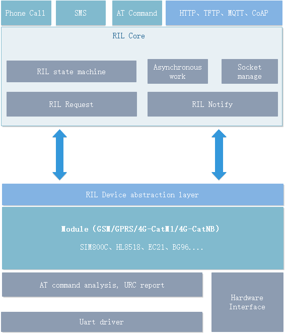

# RIL(Radio Interface Layer)
[](https://gitee.com/moluo-tech/ril/blob/master/LICENSE)[](http://moluo-tech.gitee.io/ril)

> Welcome to use RIL, ongoing update...

## Brief

RIL is a wireless communication module (GSM/GPRS/CatM1/NB-Iot) management software specially developed for embedded platforms. It is different from other large-scale frameworks (such as Android RIL, Wince RIL) in that it is designed to be used in resource-constrained IoT terminal devices (MCU + wireless module solution), and provides basic functions required for IoT communication , Including network registration, connection management, SMS sending and receiving, and Socket communication. Currently, EC21, SIM900A, HL8518 and other modules are supported, and related applications are also being continuously updated.

## Features

- Including network registration, connection management, SMS and Socket communication management.
- Scalability, module drivers are managed in a plug-in way, multiple modules can be mounted and adapted in the same system, and module drivers can be dynamically selected.
- Portability，It can be applied to different RTOS platforms through simple modifications.
- Highly reliable, built-in exception handling mechanism in various situations to ensure stable operation of the module.
- Built-in common components, such as HTTP file download with breakpoint continuation function, TCP/UDP communication, MQTT, etc.

## System Requirements

In order for RIL to operate normally, the target system must meet the following requirements:

- ROM resources: at least 13.5K Bytes (depending on the number of modules mounted and the components used).
- RAM resources: at least 1.2K Bytes (depending on the number of sockets created).
- RTOS and stack: RIL needs to run in two tasks, the stack of each task is at least 256 Bytes.
- Compiler: Since RIL uses some C99 features (flexible arrays, inlining), the compiler needs to enable C99 support. For IAR, it is turned on by default, and Keil MDK needs to manually increase the compilation option (--c99 --gnu).

## Software Architecture

## Development Guide

```c
#include "ril.h"
//....
//Create the RIL task.

ril_init(&adt, &cfg);     //Initialize RIL

ril_use_device("EC21");   //Select the module model that matches the hardware

ril_open();               //Open deivce.

ril_netconn(true);        //Start the network connection.
//...
```

For more detailed documentation, please refer to:
- [Quick start](http://moluo-tech.gitee.io/ril/#/)
- [Application cases](http://moluo-tech.gitee.io/ril/#/caseShow)
- [OS porting guide](http://moluo-tech.gitee.io/ril/#/portingGuide)
- [Module porting guide](http://moluo-tech.gitee.io/ril/#/addModule)

## Contribution

1.  Fork the repository
2.  Create Feat_xxx branch
3.  Commit your code
4.  Create Pull Request
5.  If you find any problems or major BUGs during use, please remember to leave a message, the author will be very grateful!

