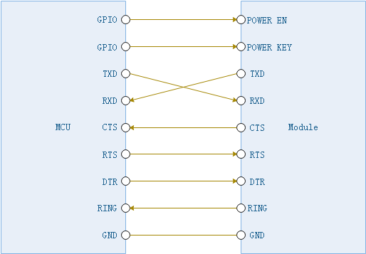
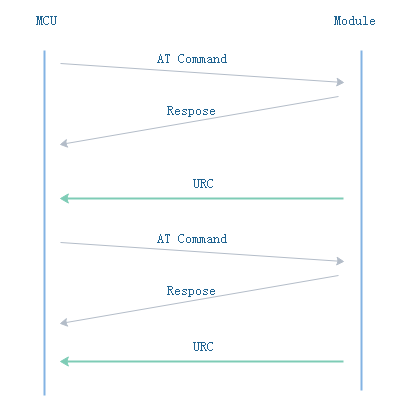
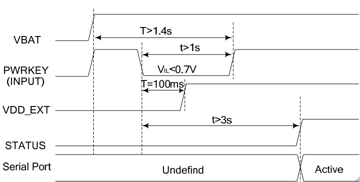

# 模组适配指南

## 概述

在先前简介部分我们了解了RIL整体软件架构，RIL核心层与模组驱动是通过RIL设备抽象层进行衔接的，RIL设备抽象层之下是各类模组驱动程序。目前RIL已经自带了几款典型的驱动程序(ril/modules目录下)，包含移远的EC21/BG96/BC35、sierra的HL8518，如果你当前使用的硬件没有包括在内，你可以通过本章节了解到如何编写一个新模组驱动程序，并学习如何通挂载并安装模组驱动程序到RIL内核中。

与模组驱动相关的头文件包含在ril_deivce.h中，里面声明了模组设备驱动所需要实现的方法、AT命令通信函数以及URC事件处理等，在编写模组驱动之前，需要先了解下面几个基础知识：

- 硬件接口及通信流程
- 模组设备结构
- AT命令处理
- URC处理
- 模组驱动安装

## 硬件接口及通信流程

开始之前我们先对模组与主控MCU硬件接口图及通信方式作一个大概的了解，为后续要介绍软件开发适配做好准备。

### 硬件接口

下图是一个典型的模组与主控MCU硬件接线图，主控MCU通过串口发送模组进行交互，POWER EN与POWER KEY用于控制模组电源上下电；DTR常用控制模组休眠与唤醒功能；RING引脚作为事件指示，例如收到短信、来电、URC。



###  通信流程

如下图所示，根据数据交互方式不同，对于主机(MCU)与从机(模组)在通信流程上有2种形式：

- 请求响应式，由MCU下发AT指令，模组回复相应的数据与结果码给MCU例如:

```c
主机  =>
          AT+CSQ?
从机  <=
          +CSQ:12,0
          OK
```

- 未经请求主动上报，又称URC(Unsolicited Result Code)，MCU未下发请求的情况下，模组根据自身的运行状态或者事件主动上报消息给MCU。

```c
+SIM: 1                           //SIM卡状态
+CME ERROR:2                      //异常状态上报
```





## 模组设备结构

在RIL系统中，使用ril_device结构体描述一个模组设备。

```c
/*ril设备 --------------------------------------------------------------------*/        
typedef struct ril_device {
    char                   *name;                   /* 设备名称 */
    const ril_device_ops_t *ops;                    /* 设备操作接口 */
    ril_adapter_t          *adap;                   /* 接口适配器 */   
    at_obj_t               *at;                     /* AT通信控制器 */    
    ril_config_t           *config;                 /* 设备配置参数*/
}ril_device_t;
```

- name : 设备名称，应用层在使用ril_use_device在选择模组型号时是通过个名称进行匹配的。
- ops : 设备操作接口，里面定义了一系列适配模组需要实现的方法，这也是接来重点要讲的内容。
- adap : 硬件接口适配器，包含了模组硬件串口通信、用于开关机引脚控制等接口。我们在编写模组驱动程序时可以通过它来直接控制硬件,例如在控制模组开关机时需要访问到它的引脚控制接口。
- at : 控制通信控制器，在处理特殊AT指令通信才用到，为了方便进行AT命令通信ril_device.h已经封装好了常用的AT命令通信接口。
- config : 模组配置参数，如APN、网络制式、频段(<u>当前版本未支持</u>)等。

实际一个新的模组驱动程序我们只需要实现ril_device的成员结构ops定义的接口即可，其定义如下：

```c
/*设备操作接口(operations) ----------------------------------------------------*/
typedef struct ril_device_ops {
    /*基本操作接口 ------------------------------------------------------------*/       
    int (*startup)(struct ril_device *);    
    int (*shutdown)(struct ril_device *);    
    int (*init)(struct ril_device *);     
    int (*reset)(struct ril_device *);
    /*网络相关操作 ------------------------------------------------------------*/   
    int (*pdp_setup)(struct ril_device *);    
    int (*pdp_contrl)(struct ril_device *, bool active);
    /**
     * @brief         设备请求
     * @param[in/out] data - 参考ril_request_code描述
     * @param[in]     size - data大小
     */
    int (*request)(struct ril_device *, ril_request_code code, void *data, int size);                         
    /* socket 相关接口 -------------------------------------------------------*/
    struct {        
        int (*connect) (struct ril_device *, socket_base_t *s);      
        int (*disconnect)(struct ril_device *, socket_base_t *s);            
        int (*send)(struct ril_device *r, socket_base_t *s ,const void *buf,
                     unsigned int len);      
        unsigned int  (*recv) (struct ril_device *, socket_base_t *s, void *buf,
                               unsigned int len); 
        /**
         * @brief     获取连接状态
         */         
        sock_request_status (*conn_status)(struct ril_device *, socket_base_t *);
        /**
         * @brief     获取发送状态
         */         
        sock_request_status (*send_status)(struct ril_device *, socket_base_t *);
    } sock;     
} ril_device_ops_t;

```

可以看到ril_device_ops每个成员函数中都包含了ril_device，我们可以使用它来完成AT命令通信、硬件时序控制等功能。主要包含下面几类：

- 基本操作接口，如开关机操作，休眠唤醒等。
- 网络相关操作，如网络参数配置，PDP创建与激活。
- 设备请求操作，包含一些不通用的操作，如获取IMEI，设置DNS等。
- socket通信，包含创建、销毁，数据收发等。

## AT命令处理

AT命令通信是模组驱动中最频繁使用的操作，几乎每个接口的实现都需要用到AT命令交互。AT指令都以”AT”开头,以<CR><LF>(即\r\n,回车换行)为结束的字符串。每个命令执行成功与否都有相应的返回（"OK"或者"ERROR"）。一般的通信流程是由主机(MCU)下发AT指令，从机(模组)回复相应的数据与结果码给主机，根据通信方式的不同大致可分类为：

1、 测试命令

命令格式为AT+<cmd>=?，用于查询设置命令设置的参数以及其取值范围。

2、 查询命令

命令格式为AT+<cmd>?，用于返回参数的当前值。

3、 设置命令

命令格式为AT+<cmd>=<p1>[,<p2>[,<p3>[...]]]，用于设置用户配置参数。

4、 执行命令

命令格式为AT+<x>，执行系统相关操作，常用于查询系统信息，如读取IMEI号使用AT+CGSN。

5、扩展命令（多用于短信、数据业务）

对于扩展命令，主要用于特殊的通信交互，例如sms收发，socket数据收发。不同模组产商是不一样的，而且命令的格式并没有统一的规则，命令中间可会夹杂着二进制数据。下面是几个扩展命令的例子。

发送短信流程(参考SIM900A模组)：

```c
主机  =>
      AT+CMGS=<Phone numer> + \x1A     //发送目标手机号+ctrl+z
从机  <=
      '<'                              //从机回复提示符'<'
主机  =>   
      <sms message>                    //发送短信内容
从机  <=
      OK                               //从机回复OK
```

发送Socket数据流程(参考移远EC21模组)：

```c
主机  =>
      AT+QISEND=<connectID>,<send_length> 
从机  <=
      '<'                              //从机回复提示符'<'
主机  =>   
      <data>                           //发送二进制数据内容
      \x1A                             //发送CTRL+z启动发送
从机  <=
      OK                               //从机回复OK
```

对于前四种AT命令，ril_deivce.h中专门提供这些命令交互的处理函数，灵活运用这些函数可以完成大部分AT通信，它们包括：

- ril_exec_cmd，用于处理需要解析回复内容的场景。
- ril_exec_cmdx，用于处理需要解析回复内容的场景，并允许指定特定的接收内容及等待超时时间
- ril_send_singleline，单行命令处理，用于不需要解析回复内容的场景
- ril_send_multiline，多行命令处理，用于批量配置的场景

**扩展命令处理**

上面我们介绍的4种命令的通信流程都是一问一答式的，主机发送1行命令请求，从机响应数据及状态，双方只交互一次。扩展命令流程比较复杂了，需要主控MCU与模组进行2次以上交互才能完成，虽然多数情况下可以通过组合命令(例如分开执行多次ril_exec_cmd)来实现，但并不能保证是线程安全的，由于于没有了锁的保护，工作在抢占式式的多任务环境下，有可能当前命令序列还未执行完就可能被其它任务抢去执行其它命令去了，从而破坏会整个命令执行流程。处理这个问题可以使用at组件中的at_do_work函数来实现，它可以自定义AT通信交互逻辑并且内部对AT通信进行了加锁保护保证线程安全。相关的函数在ril/core/at.h有声明。

```c
/*
  * @brief       执行AT作业
  * @param[in]   at    - AT控制器
  * @param[in]   work  - 作业入口函数(类型 - int (*)(at_work_ctx_t *))
  * @param[in]   params- 作业参数
  * @return      依赖于work的返回值
  */
int at_do_work(at_obj_t *at, at_work work, void *params);
```

可以看到使用这个函数需要提供at_obj_t类型的对象，这个可以从ril_device中的<at>成员获取，work作为自定义AT命令的入口函数，其中类型at_work_ctx_t的参数提供了自定义AT通信所需的接口，下面我们通过实际RIL Socket发送功能来详细讲解它的使用。

## URC事件处理

前面我们讲过，模组在工作过程中，会根据自身的情况自动上报相关状态上来，如SIM状态切换，PDP激活成功/失败，Socket连接/发送状态等。由于不同模组的URC并不完全兼容，在数据格式上有一定的差异，所以我们需要根据模组指令集描述的格式对它们进行解析，然后将这些状态以通知的形式递交到RIL内核。

### URC码格式

1、对于大多数URC码，通常是单行输出的，一般是以“+”为前缀，回车换行结束。

```  c
"+SIM: 1 \r\n"                          //SIM卡状态

"+CREG: 1,"24A4","000012CF",1\r\n"      //网络注册状态更新

"+CME ERROR:2 \r\n"                     //异常状态上报
```

2、也有不带前缀'+'的URC(参考SIM900A模组)：

```c
"RDY \r\n"                              //开机就绪
```

3、非回车换行结束的URC

收到TCP的数据(参考HL8518模组),URC后面是一串二进制数据。

```c
"+KTCP_DATA: <session_id>,<data length>[,<data>]"
```

### 捕获URC

在解析URC之前，需要对它们进行捕获，RIL根据URC码格式需要，提供了<ril_urc_register>以及<ril_urc_ex_register>两类宏来处理。

```c
/*
 * @brief   注册URC接收处理程序
 * @param   prefix   - urc 串前缀(如"+CSQ:"),默认"\r\n"作为结束符
 * @param   handler  - urc处理程序
 *              void (*handler)(at_urc_ctx_t *ctx);
 */
#define ril_urc_register(prefix, handler) \
__ril_urc_register(prefix, NULL, handler)

/*
 * @brief   注册URC接收处理程序(支持指定结束标记)
 * @param   prefix   - urc 串前缀(如"+CSQ:")
 * @param   end_mark - 结束标记(支持[+,\r\n : "]，如果不指定则默认为"\r\n")
 * @param   handler  - urc接收处理程序
 *              void (*handler)(at_urc_ctx_t *ctx);
 * @attention   URC码必须是唯一的,当前版本还不能处理不同设备同一个URC的情况
 */
#define ril_urc_ex_register(prefix, end_mark, handler) \
__ril_urc_register(prefix, end_mark, handler)
```

对于前2种以"\r\n"结束的URC，直接使用第一个宏将URC前缀及回调函数注册进去即可。当前AT解析程序匹配接收到指定的URC前缀之后，会自动调用相应的回调函数并将接收到的数据放到at_urc_ctx_t 指向的对象中，里面包含了URC行所有信息，其定义如下：

```c
/**
 * @brief URC 上下文(Context) 定义
 */
typedef struct {
    /**
     * @brief   数据读取接口
     * @params  buf   - 缓冲区
     * @params  len   - 缓冲区大小    
     */
    unsigned int (*read)(void *buf, unsigned int len);       
    char *buf;                                                /* 数据缓冲区 */
    int bufsize;                                              /* 缓冲区大小 */
    int recvlen;                                              /* 已接收数据长度*/
} at_urc_ctx_t;
```

而对于非回车换行结束的URC，除了部分头部信息之外它们并没有固定的结束标志，这种有头没尾的格式无法通过一种通用的手段将它们识别并全部提取出来。那么如何应对这种情况？RIL中的AT解析器在这里提供了一种简单的方式来处理这个问题。既然这类URC有固定的头部信息，那么只需要指定一个头部信息结束的标志给AT解析器，这里可以通过第二个宏来完成，AT解析器一旦将整个头部识别出来之后就直接通知上层的URC处理程序，后面的数据由URC处理程序自己通过at_urc_ctx_t 提供的read接口将剩余数据读取出来并根据对应的格式进行解析。 

### 事件通知

在捕获并解析完URC事件之后，需要发送通知给RIL内核，以便系统能够根据当前模组状态重新调整工作逻辑。根据URC事件类型的不同分为2种：

- RIL系统通知
- Socket事件通知

**RIL系统通知**

适用于一般的URC事件，比如注册状态更新，收到短信等，使用ril_notify进行处理，函数原型如下：

```c
/**
 * @brief       ril通知(一般用于URC事件)
 * @param[in]   type - 通知类型
 *                  @arg  RIL_NOTIF_SIM           SIM 卡状态更新
 *                  @arg  RIL_NOTIF_NETSTAT       注册状态更新 
 *                  @arg  RIL_NOTIF_NETCONN       连接状态更新
 *                  @arg  RIL_NOTIF_SMS           收到短信
 *                  ...
 *
 * @param[in]   data       - 事件数据,参考ril_notify_type描述
 * @param[in]   data_size  - 事件数据长度
 * 
 */
int ril_notify(ril_notify_type type, void *data, int data_size)
```

**Socket事件通知**

适用于socket状态上报，如连接/发送状态更新，收到数据等，使用ril_socket_notify进行处理，函数原型如下：

```c
/**
 * @brief       产生socket通知
 * @param[in]   s      - socket
 * @param[in]   type   - 通知类型
 * @param[in]   data   - 通用数据,参考sock_notify_type描述
 * @return      none
 */
void ril_socket_notify(socket_base_t *base, sock_notify_type type, void *data, int size)
```

### 范例1

下面演示的是HL8518模组的SIM卡丢失事件处理程序，在模组工作的过程中，如果SIM从硬件上移植，那么模组会自动上报"+CPIN: 0"这个URC事件。

```c
/*
 * @brief sim卡丢失事件
 */
static void sim_urc_handler(at_urc_ctx_t *ctx)
{
    ril_sim_status sim = SIM_ABSENT;
    ril_notify(RIL_NOTIF_SIM, &sim, sizeof(int *));              //发送SIM卡丢失事件
} ril_urc_register("+CPIN: 0", sim_urc_handler);                 //注册SIM卡丢失事件处理程序
```

### 范例2

下面演示的是HL8518模组的Socket数据发送状态更新处理程序，在主控往模组的成功Socket写入数据之后，模组通过"+KTCP_ACK: <session_id>,<result> <CR><LF>"返回当前数据发送结果。

```c
/**
 * @brief       TCP数据发送状态更新 [+KTCP_ACK: <session_id>,<result> <CR><LF>]
 *              <session_id> Index of the TCP session
 *              <result> 0 Data sent failure
 *                       1 Data sent success
 * @param[in]   buf  
 * @retval      none 
 */
static void tcp_sendack_urc(at_urc_ctx_t *ctx)
{
    int session, status;
    socket_base_t *s;
    if (sscanf(ctx->buf, "+KTCP_ACK: %d,%d", &session, &status) == 2){        
        s = find_socket_by_tag((void *)session);  
        if (s == NULL) {
            //异常session,应强制关闭
            //....
            return;
        }
        if (status)
            ril_socket_notify(s, SOCK_NOTFI_SEND_SUCCESS, 0, 0);//数据发送成功
        else
            ril_socket_notify(s, SOCK_NOTFI_SEND_FAILED, 0, 0);//数据发送失败
    }
} ril_urc_register("+KTCP_ACK:", tcp_sendack_urc);             //注册TCP数据发送状态更新处理程序
```


## 开始适配

了解完上面的基本知识之后，接下来我们开始编写模组驱动程序。虽然ril_device_ops_t定义了很多函数指针，但并不需要全部实现，大多数直接填写NULL即可，因为RIL会自动使用内置默认接口来实现，如果查询网络注册状态，查询SIM卡状态等功能。大多数情况下，用户只需要实现下面几类模组差异比较大的操作。

- 开关机控制。
- 模组初始化配置，设置模块相关参数等。
- 网络连接配置，如APN配置及PDP激活。
- socket创建、销毁、数据收发、状态获取。
- RIL请求，如获取网络连接状态，软/硬版本号等。

### 开机控制

模组开机并非只是简单的打开电源即，需要按照模组规格书时序图进行，不同型号的模组开机时序略有差异，但基本上都是通过POWER KEY引脚来控制的。如下图所示，以SIM800C开机为例，用户可以通过下拉PWRKEY引脚至少1秒上电SIM800，然后释放概3S之后，串口才可用，并且模组会输出"RDY"的URC串出来。



设备开机函数原型定义如下:

```c
static int startup(struct ril_device *dev)
```

第一步先定义一个开机标志位并注册一个URC:“RDY”开机事件，这样等触发这个事件之后，我们将标志位置起来，表示设备已经启动，如果进行AT命令通信。

```c
static bool sim800_power_up = false;                         //开机标志位
/*
 * @brief SIM800开机事件
 */
static void power_on_handler(at_urc_ctx_t *ctx)
{
    sim800_power_up = true;
} ril_urc_register("RDY", power_on_handler);
```

接下来我们按上面的时序来控制相关引脚，引脚控制的相关控制接口定义在ril_device的适配器(adap)中，完整的实现代码如下。

```c
/**
 * @brief       启动模组
 */ 
static int sim800_startup(struct ril_device *dev)
{
    unsigned int timer;
    int i = 0;
    sim800_power_up = false;                              //清除开机标志
    for (i = 0; i < 3; i++) {
        dev->adap->pin_ctrl(RIL_PIN_RESET, 0, 1);
        dev->adap->pin_ctrl(RIL_PIN_POWER, 0, 1);          //给模组上电
        dev->adap->pin_ctrl(RIL_PIN_PWRKEY, 0, 0);         //拉低POWER KEY引脚       
        at_delay(1000);                                    //等待1S
        dev->adap->pin_ctrl(RIL_PIN_PWRKEY, 0, 1);          
        timer = at_get_ms();
        while (!sim800_power_up &&!at_istimeout(timer, 20 * 1000)) {
            at_delay(10);
        }
        if (ril_send_singleline("AT") == RIL_OK) {        //发送AT确认是否启动成功                     
            return RIL_OK;
        }
        dev->adap->pin_ctrl(RIL_PIN_RESET, 0, 0);         //开机失败处理  
        dev->adap->pin_ctrl(RIL_PIN_PWRKEY, 0, 0);
        dev->adap->pin_ctrl(RIL_PIN_POWER, 0, 0);        
        at_delay(2000);
    }
    return RIL_ERROR;
}
```

### 关机控制

这里还是以SIM800C为例讲解关机时序，从SIM800C硬件规格书我们了解到，它提供了两种正常的关机方式：

1. 通过PWERKEY关机，用户可以通过下拉PWRKEY引脚至少1秒，然后松开来关闭SIM800C。

2. 通过AT命令，用户可能下发“AT+CPOWD=1”来关机。

   

在这里我们第2种方式，使用AT命令来关机，在完成下电程序之前，模块将产生URC:"NORMAL POWER DOWN"。

```c
/* 
 * @brief       关闭模组
 */ 
static int sim800c_shutdown(struct ril_device *dev)
{
    char recv[32];
    int ret;
    at_respond_t resp = {"NORMAL POWER DOWN", recv, sizeof(recv), 20 * 1000};  //等待时间较长
    ret = ril_exec_cmdx(&resp, "AT+CPOWD=1");
    at_delay(2000);
    dev->adap->pin_ctrl(RIL_PIN_POWER, 0, 0);
    dev->adap->pin_ctrl(RIL_PIN_PWRKEY, 0, 0);
    dev->adap->pin_ctrl(RIL_PIN_RESET, 0, 0);
    return ret;
}
```

?> 最后这里特别说明一下，为什么关机不能直接断开电源，而非得这么麻烦？因为关机的过程中模块需要先从网络注销，然后软件进入安全状态保存数据，然后才能完全关闭，如果直接暴力断开电源，一些网络状态相关的信息直接就丢失了，而且容易损坏它内部的文件系统。

### 设备初始化

设备初始化函数原型如下：

```c
int init(struct ril_device *);
```

以sim800c为例，这部分主是要给模组下发配置指令，如休眠模式、Socket的工作模式等。

```c
/**
 * @brief       模组初始化
 */
static int sim800c_init(struct ril_device *dev)
{
    const char *cmds[] = {
    "AT+CSCLK=0",                                              
    "AT+CIPSPRT=1",
    "AT+CIPMUX=1",                                              //多IP支持
    "AT+CIPSEND=1",                                             //快发模式
    NULL                                                        //多行命令结束标志
    };
    return ril_send_multiline(cmds);
}
```

### PDP 创建与激活

这一步工作准确地说应该是PDP上下文（PDP Context）激活请求，可以简单理解为拨号上网。

PDP创建与激活控制函数原型如下：

```c
int pdp_setup(struct ril_device *);
int pdp_contrl(struct ril_device *, bool active);
```

下面我们以移远模组EC21为例，讲解如何进行PDP创建与激活。

第一步先创建PDP，并配置附着参数，这些参数包含APN、APN 鉴权方式及QoS（服务质量），一般情况下只需要配置APN、APN用户名及APN密码即可，APN相关的参数由于上层用户配置，并存放在ril_device中的config域中。

```c
/** 
 * @brief    建立PDP
 */
static int ec21_pdp_setup(struct ril_device *dev)
{
    ril_config_t *c = dev->config;
    /* 
     * @brief    设置APN
     */
    if (c->apn.apn == NULL || strlen(c->apn.apn) == 0)
        return ril_exec_cmdx(NULL, "AT+CGDCONT=2,\"IPV4V6\",\"VZWADMIN\"");    
    else
        return ril_exec_cmdx(NULL, "AT+QICSGP=1,1,\"%s\",\"%s\",\"%s\",0",
                             c->apn.apn, c->apn.user, c->apn.passwd);
}
```

第二步激活控制

```c
/**  
 * @brief    网络启用/禁用控制(对应PDP激活)
 */
static int ec21_pdp_ctrl(struct ril_device *dev, bool enable)
{
    char recv[32];
    at_respond_t resp = {"OK", recv, sizeof(recv), 120 * 1000};  //等待时间较长
    return ril_exec_cmdx(&resp, "AT+%s=1", enable ? "QIACT" : "QIDEACT");  
}
```

激活状态


### 设备请求


...待完善

### Socket


- 创建socket
- 连接/断开
- 发送数据处理
- 接收数据处理
- 获取连接状态
- 获取发送状态

...待完善

### 设备安装

实现完一款模组驱动之后，我们需要将它一挂载并安装到RIL内核才能使用。这个可以通过宏ril_device_install来实现，完整的定义如下：

```c
/*
 * @brief   安装RIL设备
 * @param   name       - 设备名称(与ril_use_device指定名称匹配)
 * @param   operations - 设备操作方法集(类型:ril_device_ops_t)
 */
#define ril_device_install(name, operations) \
__ril_device_install(name, operations)
```

