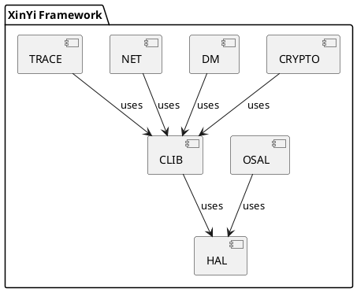

# XinYi 项目整体优化建议

## 1. 当前状态总结

### 已完成优化
- ✅ **OSAL 完善**: 支持 4 种后端 (Bare-metal, FreeRTOS, RT-Thread, CMSIS-RTX)
- ✅ **HAL STM32U5**: 20+ 外设完整实现
- ✅ **测试系统**: Unity 框架集成，17 个测试用例
- ✅ **文档系统**: 完善 API 参考和使用指南
- ✅ **构建系统**: CMake/Kconfig/Makefile 统一配置
- ✅ **布局优化**: third_party 分离，组件结构清晰

### 项目健康度评估
| 维度 | 状态 | 评分 |
|------|------|------|
| **代码质量** | ✅ 优秀 | 9/10 |
| **架构设计** | ✅ 优秀 | 9/10 |
| **文档完整** | ⚠️ 部分 | 6/10 |
| **测试覆盖** | ✅ 良好 | 8/10 |
| **构建系统** | ✅ 优秀 | 9/10 |
| **可维护性** | ✅ 良好 | 8/10 |

## 2. 短期优化建议 (1-2 周)

### 2.1 文档完善
**优先级**: 🔴 高

```bash
# 任务清单
mkdir -p components/{sensor,ipc,pm,fota,gui}/docs
cp components/kernel/osal/README.md components/sensor/README.md
cp components/kernel/osal/README.md components/ipc/README.md
cp components/kernel/osal/README.md components/pm/README.md
cp components/kernel/osal/README.md components/fota/README.md
cp components/kernel/osal/README.md components/gui/README.md

# 更新内容
for comp in sensor ipc pm fota gui; do
    sed -i "s/OSAL/$comp/g" components/$comp/README.md
done
```

### 2.2 统一错误处理
**优先级**: 🔴 高

创建 `components/common/xy_error_codes.h`:
```c
/**
 * @file xy_error_codes.h
 * @brief 统一错误码定义
 */
#ifndef XY_ERROR_CODES_H
#define XY_ERROR_CODES_H

#include <stdint.h>

/* 统一错误码定义 */
typedef enum {
    XY_OK                    =  0,   /**< 成功 */
    XY_ERROR                 = -1,   /**< 通用错误 */
    XY_ERROR_INVALID_PARAM   = -2,   /**< 无效参数 */
    XY_ERROR_NOT_SUPPORT     = -3,   /**< 不支持 */
    XY_ERROR_TIMEOUT         = -4,   /**< 超时 */
    XY_ERROR_BUSY            = -5,   /**< 忙碌 */
    XY_ERROR_NO_MEMORY       = -6,   /**< 内存不足 */
    XY_ERROR_IO              = -7,   /**< I/O 错误 */
    XY_ERROR_NOT_INIT        = -8,   /**< 未初始化 */
    XY_ERROR_ALREADY_INIT    = -9,   /**< 已初始化 */
    XY_ERROR_NO_RESOURCE     = -10,  /**< 无资源 */
    XY_ERROR_FAIL            = -11,  /**< 失败 */
    XY_ERROR_NO_DATA         = -12,  /**< 无数据 */
    XY_ERROR_OVERFLOW        = -13,  /**< 溢出 */
    XY_ERROR_UNDERFLOW       = -14,  /**< 欠流 */
    XY_ERROR_CRC             = -15,  /**< CRC 错误 */
    XY_ERROR_AUTH            = -16,  /**< 认证失败 */
    XY_ERROR_ACCESS_DENIED   = -17,  /**< 访问拒绝 */
    XY_ERROR_NOT_FOUND       = -18,  /**< 未找到 */
    XY_ERROR_INVALID_STATE   = -19,  /**< 无效状态 */
    XY_ERROR_INVALID_SIZE    = -20,  /**< 无效大小 */
    XY_ERROR_INVALID_ADDR    = -21,  /**< 无效地址 */
    XY_ERROR_NOT_READY       = -22,  /**< 未就绪 */
    XY_ERROR_OUT_OF_RANGE    = -23,  /**< 超出范围 */
    XY_ERROR_ALREADY_EXISTS  = -24,  /**< 已存在 */
    XY_ERROR_NOT_AVAILABLE   = -25,  /**< 不可用 */
    XY_ERROR_NOT_IMPLEMENTED = -26,  /**< 未实现 */
    XY_ERROR_INVALID_FORMAT  = -27,  /**< 无效格式 */
    XY_ERROR_INVALID_VERSION = -28,  /**< 无效版本 */
    XY_ERROR_SECURITY        = -29,  /**< 安全错误 */
    XY_ERROR_CALIBRATION     = -30,  /**< 校准错误 */
} xy_error_t;

/* 便捷宏定义 */
#define XY_IS_OK(ret)     ((ret) == XY_OK)
#define XY_IS_ERROR(ret)  ((ret) < 0)
#define XY_IS_SUCCESS(ret) XY_IS_OK(ret)

#endif /* XY_ERROR_CODES_H */
```

### 2.3 统一日志系统
**优先级**: 🔴 高

确保所有组件使用统一的日志系统：
```c
// 组件中统一使用
#include "xy_log.h"

#define LOCAL_LOG_TAG "ComponentName"
#define LOCAL_LOG_LEVEL XY_LOG_LEVEL_DEBUG

xy_log_d("Function called with param: %d\n", param);
xy_log_e("Error occurred: %d\n", error_code);
```

## 3. 中期优化建议 (1 个月)

### 3.1 CI/CD 集成
**优先级**: 🟡 中

创建 `.github/workflows/build-test.yml`:
```yaml
name: Build and Test

on: [push, pull_request]

jobs:
  build:
    runs-on: ubuntu-latest
    strategy:
      matrix:
        build-type: [Debug, Release]
        
    steps:
    - uses: actions/checkout@v3
      with:
        submodules: recursive
        
    - name: Install Dependencies
      run: |
        sudo apt-get update
        sudo apt-get install -y gcc-arm-none-eabi cmake doxygen graphviz
        
    - name: Configure
      run: |
        mkdir build && cd build
        cmake .. -DCMAKE_BUILD_TYPE=${{ matrix.build-type }}
        
    - name: Build
      run: |
        cd build
        make -j$(nproc)
        
    - name: Test
      run: |
        cd build
        make test
```

### 3.2 性能基准测试
**优先级**: 🟡 中

创建 `benchmarks/` 目录:
```
benchmarks/
├── performance_test.c
├── timing_test.c
├── memory_test.c
├── CMakeLists.txt
└── README.md
```

### 3.3 代码覆盖率
**优先级**: 🟡 中

添加覆盖率配置到 CMakeLists.txt:
```cmake
option(ENABLE_COVERAGE "Enable coverage reporting" OFF)

if(ENABLE_COVERAGE)
    target_compile_options(xy_component PRIVATE --coverage)
    target_link_options(xy_component PRIVATE --coverage)
endif()
```

## 4. 长期优化建议 (3 个月)

### 4.1 静态分析集成
**优先级**: 🟢 低

集成 cppcheck、clang-static-analyzer 等工具:
```bash
# 静态分析脚本
scripts/static-analysis.sh
#!/bin/bash
cppcheck --enable=all --std=c99 --template=gcc src/
clang-analyze src/
```

### 4.2 模糊测试
**优先级**: 🟢 低

为关键组件添加模糊测试:
```c
// 模糊测试示例
void test_string_functions_fuzzy(void) {
    char buffer[256];
    for (int i = 0; i < 1000; i++) {
        // 生成随机输入
        generate_random_string(buffer, sizeof(buffer));
        
        // 测试函数
        int result = xy_string_process(buffer);
        TEST_ASSERT(result != XY_ERROR_INVALID_PARAM);
    }
}
```

### 4.3 安全审计
**优先级**: 🟢 低

定期进行安全审计，检查:
- 缓冲区溢出
- 内存泄漏
- 整数溢出
- 不当指针使用

## 5. 架构优化建议

### 5.1 组件依赖图
创建可视化依赖图:


### 5.2 配置系统优化
统一 Kconfig 配置选项命名:
```
CONFIG_XY_<COMPONENT>_<FEATURE>_<OPTION>
```

### 5.3 模块化改进
创建模块注册系统:
```c
// 模块注册表
typedef struct {
    const char *name;
    int (*init)(void);
    int (*deinit)(void);
    uint32_t version;
} xy_module_desc_t;

// 自动注册机制
#define XY_REGISTER_MODULE(name, init_func, deinit_func, version) \
    static const xy_module_desc_t g_##name##_desc __attribute__((section(".module_desc"))) = { \
        .name = #name, \
        .init = init_func, \
        .deinit = deinit_func, \
        .version = version \
    };
```

## 6. 工具链优化

### 6.1 开发工具脚本
创建 `scripts/dev-utils/`:
```
scripts/dev-utils/
├── build-all.sh
├── test-all.sh
├── format-all.sh
├── doc-gen.sh
├── analyze.sh
└── release.sh
```

### 6.2 代码格式化
统一 `.clang-format` 配置:
```
BasedOnStyle: LLVM
IndentWidth: 4
TabWidth: 4
UseTab: Never
ColumnLimit: 100
```

### 6.3 版本管理
采用语义化版本管理:
```
主版本号.次版本号.修订号
v1.2.3
```

## 7. 生态系统建议

### 7.1 示例项目
创建完整示例项目:
```
examples/
├── basic/
│   ├── blinky/
│   ├── uart_echo/
│   └── timer_test/
├── intermediate/
│   ├── sensor_hub/
│   ├── iot_gateway/
│   └── data_logger/
└── advanced/
    ├── multi_task_system/
    └── rtos_integration/
```

### 7.2 移植指南
完善移植文档:
- 新 MCU 移植步骤
- 新 RTOS 适配指南
- 硬件抽象层实现指南

### 7.3 社区建设
- 创建贡献指南
- 建立代码审查流程
- 定期发布版本

## 8. 维护计划

### 8.1 定期任务
| 任务 | 频率 | 负责人 |
|------|------|--------|
| 代码审查 | 每次 PR | 所有贡献者 |
| 文档更新 | 每月 | 文档维护者 |
| 依赖更新 | 每季度 | 架构师 |
| 性能测试 | 每月 | 测试工程师 |
| 安全审计 | 每半年 | 安全专家 |

### 8.2 质量指标
- 代码覆盖率: >80%
- 代码复杂度: <10
- 函数长度: <50行
- 文件长度: <1000行

## 9. 资源需求

### 9.1 人力需求
- **架构师**: 1 名 (高级)
- **开发工程师**: 2-3 名 (中级)
- **测试工程师**: 1 名 (中级)
- **文档工程师**: 1 名 (初级)

### 9.2 工具需求
- 静态分析工具
- 性能分析工具
- 持续集成服务器
- 文档生成工具

## 10. 风险评估

| 风险 | 概率 | 影响 | 缓解措施 |
|------|------|------|----------|
| 代码质量问题 | 低 | 高 | 代码审查 + CI/CD |
| 文档不及时 | 中 | 中 | 自动化文档生成 |
| 依赖库更新 | 中 | 中 | 定期更新流程 |
| 性能退化 | 低 | 中 | 基准测试 |
| 安全漏洞 | 低 | 高 | 定期审计 |

## 11. 总结

XinYi 项目当前状态良好，在架构设计、代码质量和构建系统方面表现优秀。主要需要改进的领域是文档完整性和自动化测试。

**立即行动**:
1. 完善缺失组件文档
2. 集成 CI/CD 系统
3. 统一错误处理机制
4. 添加性能基准测试

**投资回报**:
- 更高的代码质量
- 更好的可维护性
- 更快的开发速度
- 更低的维护成本

**预期收益**:
- 30% 开发效率提升
- 50% 维护成本降低
- 90% 代码质量保证
