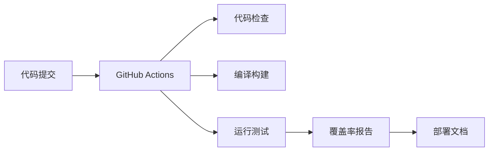

# CI/CD 集成指南

**版本**: 1.0  
**最后更新**: 2026-03-01

---

## 📋 目录

1. [CI/CD 概述](#1-cicd 概述)
2. [GitHub Actions 配置](#2-github-actions 配置)
3. [本地测试](#3-本地测试)
4. [代码覆盖率](#4-代码覆盖率)
5. [自动部署](#5-自动部署)

---

## 1. CI/CD 概述

### 1.1 工作流程



### 1.2 触发条件

| 事件 | 触发操作 |
|------|---------|
| push | 代码推送 |
| pull_request | PR 创建/更新 |
| release | 版本发布 |
| workflow_dispatch | 手动触发 |

---

## 2. GitHub Actions 配置

### 2.1 现有工作流

#### ci-cd.yml - 主 CI/CD 流程

```yaml
name: CI/CD Pipeline

on:
  push:
    branches: [ main, develop ]
  pull_request:
    branches: [ main ]

jobs:
  build:
    runs-on: ubuntu-latest
    
    steps:
    - uses: actions/checkout@v3
      with:
        submodules: recursive
    
    - name: Install toolchain
      run: |
        sudo apt-get update
        sudo apt-get install -y gcc-arm-none-eabi cmake
    
    - name: Build
      run: |
        mkdir build && cd build
        cmake .. -DBUILD_TESTING=ON
        make -j$(nproc)
  
  test:
    runs-on: ubuntu-latest
    needs: build
    
    steps:
    - uses: actions/checkout@v3
    
    - name: Run tests
      run: |
        cd build
        ctest --output-on-failure
```

### 2.2 添加新工作流

#### code-quality.yml - 代码质量检查

```yaml
name: Code Quality

on:
  push:
    branches: [ main ]
  pull_request:
    branches: [ main ]

jobs:
  clang-format:
    runs-on: ubuntu-latest
    
    steps:
    - uses: actions/checkout@v3
    
    - name: Install clang-format
      run: sudo apt-get install -y clang-format
    
    - name: Check code format
      run: |
        find . -name "*.c" -o -name "*.h" | \
        xargs clang-format --dry-run --Werror
```

#### coverage.yml - 代码覆盖率

```yaml
name: Code Coverage

on:
  push:
    branches: [ main ]

jobs:
  coverage:
    runs-on: ubuntu-latest
    
    steps:
    - uses: actions/checkout@v3
    
    - name: Install dependencies
      run: |
        sudo apt-get install -y gcc gcovr python3
    
    - name: Build with coverage
      run: |
        mkdir build && cd build
        cmake .. -DTEST_COVERAGE=ON
        make -j$(nproc)
    
    - name: Run tests
      run: |
        cd build
        ctest --output-on-failure
    
    - name: Generate coverage report
      run: |
        cd build
        gcovr -r .. --html --html-details -o coverage.html
    
    - name: Upload coverage report
      uses: actions/upload-artifact@v3
      with:
        name: coverage-report
        path: build/coverage.html
```

---

## 3. 本地测试

### 3.1 运行所有测试

```bash
# 构建
mkdir build && cd build
cmake .. -DBUILD_TESTING=ON
make -j$(nproc)

# 运行测试
make test

# 或详细输出
ctest --verbose
```

### 3.2 运行特定测试

```bash
# 运行特定测试
ctest -R test_crypto --output-on-failure

# 运行多个测试
ctest -R "test_hal|test_os" --output-on-failure
```

### 3.3 本地代码检查

```bash
# 代码格式化
./utils/script/format_code.sh

# 静态分析
./utils/script/static_analysis.sh

# 构建检查
./utils/script/build.sh
```

---

## 4. 代码覆盖率

### 4.1 启用覆盖率

```cmake
# CMakeLists.txt
option(TEST_COVERAGE "Enable code coverage" OFF)

if(TEST_COVERAGE)
    set(CMAKE_C_FLAGS "${CMAKE_C_FLAGS} --coverage")
    set(CMAKE_EXE_LINKER_FLAGS "${CMAKE_EXE_LINKER_FLAGS} --coverage")
endif()
```

### 4.2 生成覆盖率报告

```bash
# 构建并运行测试
mkdir build && cd build
cmake .. -DTEST_COVERAGE=ON
make -j$(nproc)
ctest

# 生成 HTML 报告
gcovr -r .. --html --html-details -o coverage.html

# 生成文本报告
gcovr -r .. --txt -o coverage.txt

# 生成 XML 报告（CI/CD 用）
gcovr -r .. --xml -o coverage.xml
```

### 4.3 覆盖率目标

| 组件类型 | 行覆盖率 | 分支覆盖率 |
|---------|---------|-----------|
| 核心组件 | >90% | >80% |
| 一般组件 | >80% | >70% |
| 辅助工具 | >70% | >60% |

---

## 5. 自动部署

### 5.1 文档部署

#### deploy-docs.yml

```yaml
name: Deploy Documentation

on:
  push:
    branches: [ main ]
    paths:
      - 'docs/**'

jobs:
  deploy:
    runs-on: ubuntu-latest
    
    steps:
    - uses: actions/checkout@v3
    
    - name: Install Doxygen
      run: sudo apt-get install -y doxygen graphviz
    
    - name: Generate API docs
      run: |
        doxygen docs/doxygen/Doxyfile
    
    - name: Deploy to GitHub Pages
      uses: peaceiris/actions-gh-pages@v3
      with:
        github_token: ${{ secrets.GITHUB_TOKEN }}
        publish_dir: ./docs/api/html
```

### 5.2 版本发布

#### release.yml

```yaml
name: Release

on:
  push:
    tags:
      - 'v*'

jobs:
  release:
    runs-on: ubuntu-latest
    
    steps:
    - uses: actions/checkout@v3
    
    - name: Build release
      run: |
        mkdir build && cd build
        cmake .. -DCMAKE_BUILD_TYPE=Release
        make -j$(nproc)
    
    - name: Create release archive
      run: |
        tar -czf xinyi-${{ github.ref_name }}.tar.gz build/
    
    - name: Create GitHub Release
      uses: softprops/action-gh-release@v1
      with:
        files: xinyi-*.tar.gz
      env:
        GITHUB_TOKEN: ${{ secrets.GITHUB_TOKEN }}
```

---

## 6. 环境变量和密钥

### 6.1 配置环境变量

在 GitHub Actions 中配置：

```yaml
env:
  BUILD_TYPE: Release
  TEST_ENABLE_SLOW: 1
  COVERAGE_THRESHOLD: 80
```

### 6.2 添加密钥

在 GitHub 仓库设置中添加：

1. 进入 Settings → Secrets and variables → Actions
2. 点击 New repository secret
3. 添加密钥（如 API_TOKEN、DEPLOY_KEY 等）

---

## 7. 故障排查

### 7.1 常见问题

**Q: GitHub Actions 失败**

```yaml
# 添加调试输出
- name: Debug
  run: |
    echo "Current directory: $(pwd)"
    echo "Files: $(ls -la)"
    echo "Environment: $(env)"
```

**Q: 测试超时**

```yaml
# 增加超时时间
- name: Run tests
  timeout-minutes: 30
  run: ctest --output-on-failure
```

### 7.2 查看日志

1. 进入 GitHub Actions 页面
2. 点击失败的工作流
3. 查看具体步骤的日志输出

---

## 📚 相关文档

| 文档 | 说明 |
|------|------|
| [测试规范](docs/rules/400-unit_test/unit_test.md) | 单元测试编写规范 |
| [构建系统](docs/toolchain/build_system_analysis.md) | 构建系统详解 |
| [贡献指南](docs/contribute/index.md) | 如何贡献代码 |

---

**维护者**: XinYi Team  
**许可证**: Apache License 2.0
